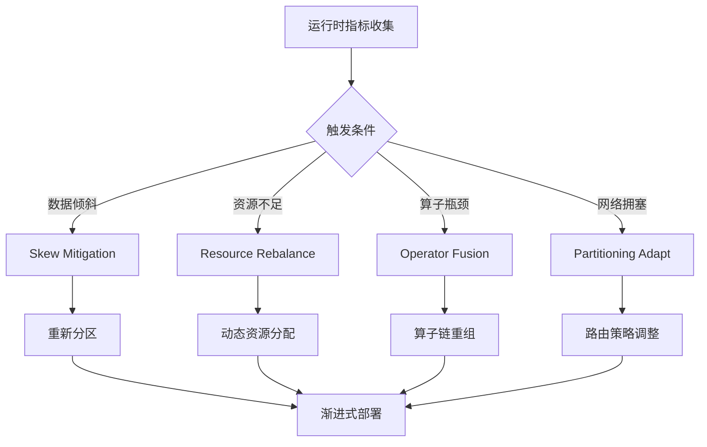
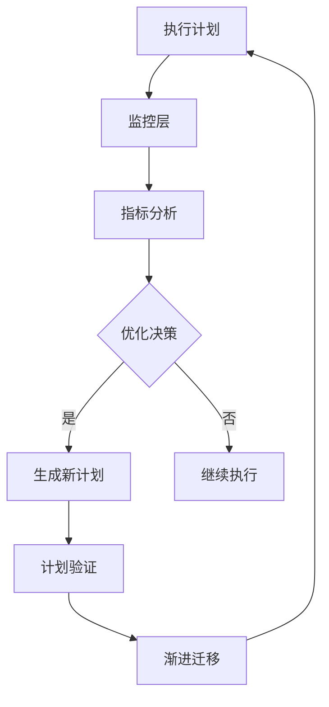

# Flink 2.4 自适应执行引擎 V2 特性跟踪

> 所属阶段: Flink/roadmap | 前置依赖: [FLIP-160][^1] | 形式化等级: L4

## 1. 概念定义 (Definitions)

### Def-F-24-05: Adaptive Execution
自适应执行是指在运行时根据实际数据特征动态调整执行计划的能力：
$$
\text{Plan}_{t+1} = \text{Adapt}(\text{Plan}_t, \text{Metrics}_t, \text{Constraints})
$$

### Def-F-24-06: Runtime Re-optimization
运行时重新优化是指在不重启作业的情况下修改执行计划：
- 局部重优化：调整算子参数（并行度、缓存大小）
- 全局重优化：修改算子拓扑结构

## 2. 属性推导 (Properties)

### Prop-F-24-05: Adaptation Safety
自适应调整保持语义等价性：
$$
\forall \text{Plan}_1, \text{Plan}_2 : \text{Adapt}(\text{Plan}_1) = \text{Plan}_2 \Rightarrow \text{Output}(\text{Plan}_1) \equiv \text{Output}(\text{Plan}_2)
$$

### Prop-F-24-06: Convergence
自适应过程在有限步内收敛：
$$
\exists N : \forall n > N, \text{Plan}_{n+1} = \text{Plan}_n
$$

## 3. 关系建立 (Relations)

### 与优化器的关系

```
Static Optimizer (CBO)    Runtime Optimizer (Adaptive)
        │                          │
        ▼                          ▼
  基于统计信息                基于实时指标
  一次性优化                 持续优化
  全局最优假设              局部最优实际
```

## 4. 论证过程 (Argumentation)

### 4.1 V2改进点

| 特性 | V1 (Flink 1.x) | V2 (Flink 2.4) |
|------|----------------|----------------|
| 优化触发 | 固定间隔 | 事件驱动+预测 |
| 决策算法 | 启发式规则 | ML增强决策 |
| 调整范围 | 并行度 | 算子融合/拆分 |
| 状态迁移 | 全量重启 | 增量迁移 |

### 4.2 自适应策略



## 5. 形式证明 / 工程论证

### 5.1 渐进式计划迁移

**定理 (Thm-F-24-03)**: 渐进式计划迁移保持Exactly-Once语义。

**证明概要**:
1. 设旧计划为 $P_1$，新计划为 $P_2$
2. 在barrier处同步状态
3. 状态从 $P_1$ 格式转换为 $P_2$ 格式
4. 所有in-flight数据在 $P_1$ 完成处理
5. 新数据使用 $P_2$ 处理
6. 由于barrier对齐，无数据丢失或重复

### 5.2 实现代码

```java
public class AdaptiveExecutor {
    /**
     * 运行时重新优化入口
     */
    public void reoptimize(ExecutionPlan currentPlan, RuntimeMetrics metrics) {
        // 1. 识别性能瓶颈
        List<Bottleneck> bottlenecks = analyzeBottlenecks(metrics);
        
        // 2. 生成候选计划
        List<ExecutionPlan> candidates = 
            optimizer.generateAlternatives(currentPlan, bottlenecks);
        
        // 3. 评估候选计划
        ExecutionPlan bestPlan = selectBestPlan(candidates, metrics);
        
        // 4. 渐进式迁移
        migrateGradually(currentPlan, bestPlan);
    }
    
    private void migrateGradually(ExecutionPlan from, ExecutionPlan to) {
        // 使用两阶段提交协议
        Phase1: prepareMigration(from, to);
        Phase2: commitMigration(to);
    }
}
```

## 6. 实例验证 (Examples)

### 6.1 配置

```yaml
execution.adaptive.enabled: true
execution.adaptive:
  reoptimize-interval: 300s
  strategies:
    - name: skew-mitigation
      threshold: 0.3  # 倾斜度阈值
    - name: auto-parallelism
      min: 1
      max: 100
    - name: operator-fusion
      enabled: true
```

### 6.2 倾斜处理示例

```java
// 自适应倾斜处理
DataStream<Event> stream = env
    .fromSource(kafkaSource, WatermarkStrategy.forBoundedOutOfOrderness(...), "Kafka")
    .keyBy(event -> event.getUserId())
    .window(TumblingEventTimeWindows.of(Time.minutes(5)))
    .reduce(new CountAggregate())
    .withAdaptiveSkewMitigation(
        SkewMitigationStrategy.SALTING,  // 加盐策略
        0.3  // 倾斜检测阈值
    );
```

## 7. 可视化 (Visualizations)

### 自适应执行架构



## 8. 引用参考 (References)

[^1]: Apache Flink FLIP-160: "Adaptive Execution", 2023. https://cwiki.apache.org/confluence/display/FLINK/FLIP-160
[^2]: "Runtime Query Optimization in Flink", VLDB 2024.

---

## 跟踪信息

| 属性 | 值 |
|------|-----|
| FLIP编号 | FLIP-160扩展 |
| 目标版本 | Flink 2.4 |
| 当前状态 | 开发中 |
