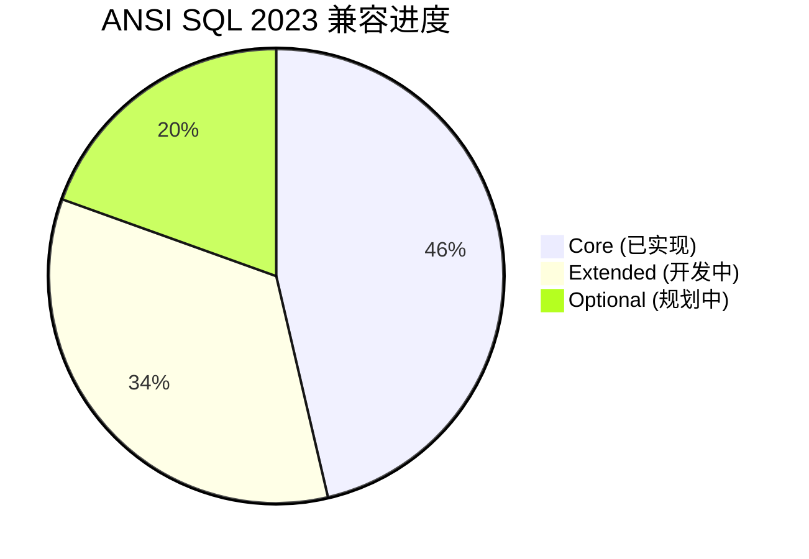

# Flink 2.4 ANSI SQL 2023 兼容 特性跟踪

> 所属阶段: Flink/roadmap | 前置依赖: [SQL标准][^1] | 形式化等级: L3

## 1. 概念定义 (Definitions)

### Def-F-24-09: ANSI SQL 2023 Compatibility
Flink对ANSI SQL 2023的兼容性分为三个级别：
- **Core**: 必需特性（SELECT, JOIN, GROUP BY等）
- **Extended**: 推荐特性（Window函数, CTE, LATERAL等）
- **Optional**: 可选特性（MATCH_RECOGNIZE, JSON支持等）

### Def-F-24-10: SQL Conformance Level
符合性级别定义为：
$$
\text{Conformance} = \frac{|\text{ImplementedFeatures}|}{|\text{RequiredFeatures}|} \times 100\%
$$

## 2. 属性推导 (Properties)

### Prop-F-24-09: Syntax Preservation
标准SQL语法在Flink中保持语义一致性：
$$
\forall Q_{\text{std}} : \text{Parse}(Q_{\text{std}}) \Rightarrow \text{Plan}(Q_{\text{std}}) \equiv \text{Plan}_{\text{std}}
$$

## 3. 关系建立 (Relations)

### SQL 2023新特性映射

| SQL 2023特性 | Flink实现 | 状态 |
|--------------|-----------|------|
| Row Pattern Recognition | MATCH_RECOGNIZE | ✅ 已支持 |
| JSON Support | JSON functions | ✅ 已支持 |
| Time Travel | Temporal Tables | ✅ 已支持 |
| Property Graph Queries | GQL subset | 🔄 开发中 |
| Additional aggregate functions | LISTAGG, etc. | 🔄 开发中 |

## 4. 论证过程 (Argumentation)

### 4.1 兼容策略

```
┌─────────────────────────────────────────┐
│         ANSI SQL 2023 Core              │
│  (100%兼容目标)                          │
├─────────────────────────────────────────┤
│    Stream-Specific Extensions           │
│  (WATERMARK, WINDOW, EMIT策略)           │
├─────────────────────────────────────────┤
│    Flink Optimizations                  │
│  (Hints, 专用函数)                       │
└─────────────────────────────────────────┘
```

## 5. 形式证明 / 工程论证

### 5.1 形式化语法

```
<stream_query> ::= <ansi_query> [ <stream_clause> ]

<stream_clause> ::= 
    [ WATERMARK FOR <column> AS <expression> ]
    [ EMIT WITH DELAY <interval> ]
    [ EMIT WITHOUT UPDATE ]
```

## 6. 实例验证 (Examples)

### 6.1 SQL 2023示例

```sql
-- Row Pattern Recognition (ANSI SQL 2023)
SELECT *
FROM events
MATCH_RECOGNIZE (
    PARTITION BY user_id
    ORDER BY event_time
    MEASURES
        A.event_time AS start_time,
        LAST(B.event_time) AS end_time,
        COUNT(*) AS event_count
    PATTERN (A B+ C)
    DEFINE
        A AS event_type = 'START',
        B AS event_type = 'CONTINUE',
        C AS event_type = 'END'
);

-- JSON Support (ANSI SQL 2023)
SELECT 
    JSON_VALUE(data, '$.user.id') AS user_id,
    JSON_QUERY(data, '$.items') AS items,
    JSON_OBJECT(
        'total' VALUE COUNT(*),
        'amount' VALUE SUM(price)
    ) AS summary
FROM orders;
```

## 7. 可视化 (Visualizations)



## 8. 引用参考 (References)

[^1]: ANSI/ISO SQL:2023 Standard
[^2]: Apache Flink SQL Documentation

---

## 跟踪信息

| 属性 | 值 |
|------|-----|
| 目标版本 | Flink 2.4 |
| 当前状态 | 开发中 |
| 兼容目标 | Core 100%, Extended 80% |
