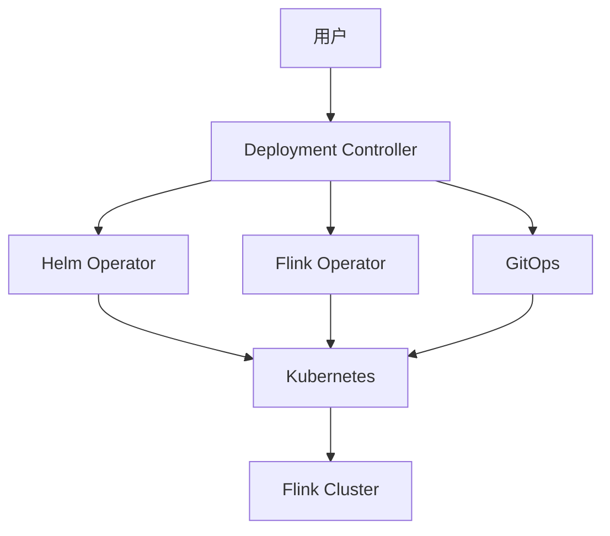
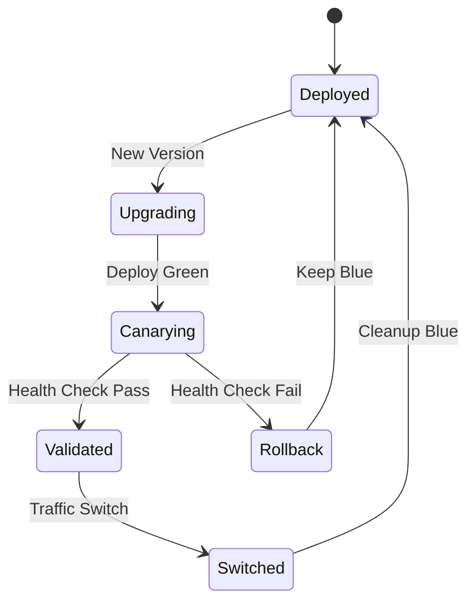

# Flink 2.4 部署改进 特性跟踪

> 所属阶段: Flink/roadmap | 前置依赖: [Deployment架构][^1] | 形式化等级: L3

## 1. 概念定义 (Definitions)

### Def-F-24-15: Deployment Mode
部署模式定义为运行Flink作业的环境配置：
- **Application Mode**: 每个作业独立JM
- **Session Mode**: 多作业共享JM
- **Serverless Mode**: 无服务器自动管理

### Def-F-24-16: Rolling Upgrade
滚动升级定义为零停机更新策略：
$$
\text{RollingUpgrade} : V_{\text{old}} \to V_{\text{new}}, \text{ s.t. } \text{Downtime} = 0
$$

## 2. 属性推导 (Properties)

### Prop-F-24-12: Upgrade Safety
滚动升级保持状态一致性：
$$
\text{State}_{\text{post-upgrade}} \equiv \text{State}_{\text{pre-upgrade}}
$$

## 3. 关系建立 (Relations)

### 部署改进特性

| 特性 | 描述 | 状态 |
|------|------|------|
| Helm Chart 2.0 | 现代化K8s部署 | GA |
| Operator增强 | 自动故障恢复 | Beta |
| 配置热更新 | 无需重启更新 | 开发中 |
| 蓝绿部署 | 零停机切换 | Beta |

## 4. 论证过程 (Argumentation)

### 4.1 部署架构演进



## 5. 形式证明 / 工程论证

### 5.1 蓝绿部署算法

**算法**:
1. 部署新版本(Green)与旧版本(Blue)并行
2. 同步状态到Green
3. 流量切换到Green
4. 验证Green健康
5. 停用Blue

## 6. 实例验证 (Examples)

### 6.1 Helm配置

```yaml
# values.yaml
flinkVersion: 2.4.0
deploymentMode: application

highAvailability:
  enabled: true
  backend: kubernetes

rollingUpgrade:
  enabled: true
  strategy: stateful  # 保持状态
```

## 7. 可视化 (Visualizations)



## 8. 引用参考 (References)

[^1]: Apache Flink Deployment Documentation

---

## 跟踪信息

| 属性 | 值 |
|------|-----|
| 目标版本 | Flink 2.4 |
| 当前状态 | 开发中 |
