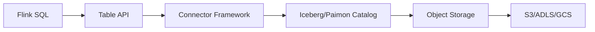
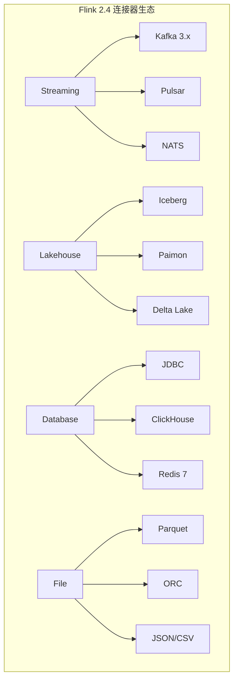

# Flink 2.4 新连接器 特性跟踪

> 所属阶段: Flink/roadmap | 前置依赖: [Connector框架][^1] | 形式化等级: L3

## 1. 概念定义 (Definitions)

### Def-F-24-11: Unified Connector API
统一连接器API定义了源(Source)和汇(Sink)的标准接口：
```
Source<T> = SplitEnumerator + SourceReader + Split
Sink<T> = SinkWriter + Committer + GlobalCommitter
```

### Def-F-24-12: Exactly-Once Delivery
精确一次投递语义：
$$
\forall m \in \text{Messages} : \text{Count}_{\text{delivered}}(m) = 1
$$

## 2. 属性推导 (Properties)

### Prop-F-24-10: Connector Isolation
连接器故障隔离性：
$$
\text{Failure}(C_i) \not\Rightarrow \text{Failure}(C_j), \forall i \neq j
$$

## 3. 关系建立 (Relations)

### 2.4新连接器列表

| 连接器 | 类型 | 源 | 汇 | 状态 |
|--------|------|----|----|------|
| Iceberg | Lakehouse | ✅ | ✅ | GA |
| Paimon | Lakehouse | ✅ | ✅ | GA |
| Kafka 3.x | Streaming | ✅ | ✅ | 更新 |
| Redis 7 | NoSQL | ✅ | ✅ | 新增 |
| ClickHouse | OLAP | ✅ | ✅ | 新增 |
| NATS | Messaging | ✅ | ✅ | 新增 |

## 4. 论证过程 (Argumentation)

### 4.1 Lakehouse连接器架构



## 5. 形式证明 / 工程论证

### 5.1 Lakehouse一致性

**定理 (Thm-F-24-05)**: Lakehouse连接器支持端到端Exactly-Once。

**证明**:
1. 使用两阶段提交协议
2. Checkpoint时prepare快照
3. Checkpoint完成时commit快照
4. 失败时从最新快照恢复

## 6. 实例验证 (Examples)

### 6.1 Iceberg配置

```sql
-- Iceberg catalog配置
CREATE CATALOG iceberg_catalog WITH (
    'type' = 'iceberg',
    'catalog-type' = 'hive',
    'uri' = 'thrift://hive:9083',
    'warehouse' = 's3://bucket/warehouse'
);

-- 创建Iceberg表
CREATE TABLE iceberg_table (
    id BIGINT,
    data STRING,
    dt STRING
) PARTITIONED BY (dt) WITH (
    'write.format.default' = 'PARQUET',
    'write.metadata.compression-codec' = 'zstd'
);
```

## 7. 可视化 (Visualizations)



## 8. 引用参考 (References)

[^1]: Apache Flink Connector Development Guide

---

## 跟踪信息

| 属性 | 值 |
|------|-----|
| 目标版本 | Flink 2.4 |
| 当前状态 | 开发中 |
| 新连接器数 | 6+ |
