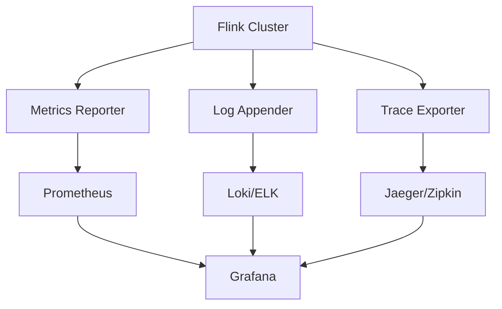
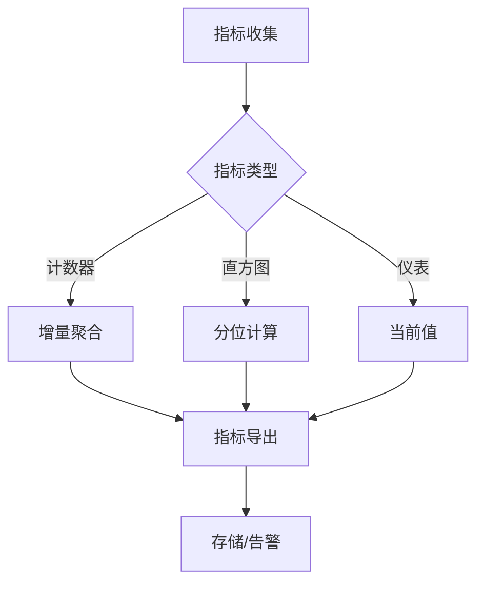

# Flink 2.4 可观测性增强 特性跟踪

> 所属阶段: Flink/roadmap | 前置依赖: [Observability框架][^1] | 形式化等级: L3

## 1. 概念定义 (Definitions)

### Def-F-24-17: Observability
可观测性通过三个支柱定义：
- **Metrics**: 定量指标（延迟、吞吐量、错误率）
- **Logs**: 事件记录
- **Traces**: 分布式追踪

### Def-F-24-18: SLO (Service Level Objective)
服务水平目标定义为：
$$
\text{SLO}: P(\text{Latency} < L_{\text{max}}) \geq 0.99
$$

## 2. 属性推导 (Properties)

### Prop-F-24-13: Metric Cardinality Bound
指标基数限制保证系统稳定：
$$
|\text{TimeSeries}| \leq C_{\text{max}}
$$

## 3. 关系建立 (Relations)

### 2.4可观测性改进

| 特性 | 描述 | 状态 |
|------|------|------|
| OpenTelemetry集成 | 标准化遥测 | GA |
| 结构化日志 | JSON格式日志 | GA |
| 火焰图 | CPU分析 | Beta |
| SLO仪表板 | 内置监控 | 开发中 |

## 4. 论证过程 (Argumentation)

### 4.1 可观测性架构



## 5. 形式证明 / 工程论证

### 5.1 指标采样

**定理**: 一致性采样保持聚合准确性。

## 6. 实例验证 (Examples)

### 6.1 OpenTelemetry配置

```yaml
metrics.reporter.otlp.enabled: true
metrics.reporter.otlp.endpoint: http://otel-collector:4317

traces.exporter: otlp
traces.otlp.endpoint: http://otel-collector:4317
```

## 7. 可视化 (Visualizations)



## 8. 引用参考 (References)

[^1]: OpenTelemetry Specification

---

## 跟踪信息

| 属性 | 值 |
|------|-----|
| 目标版本 | Flink 2.4 |
| 当前状态 | 开发中 |
