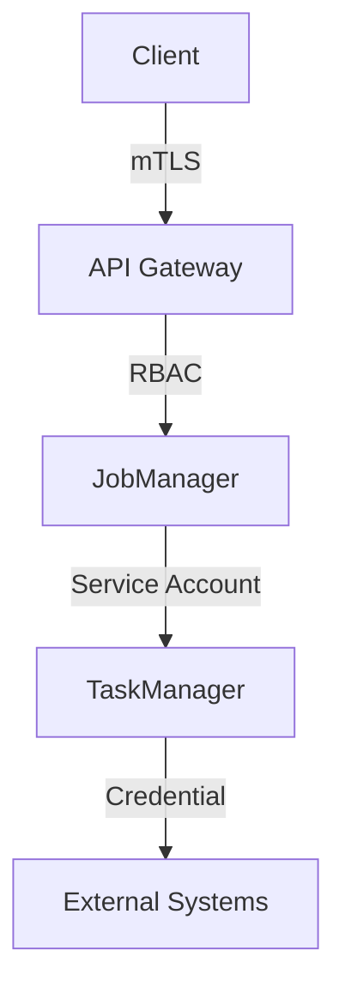
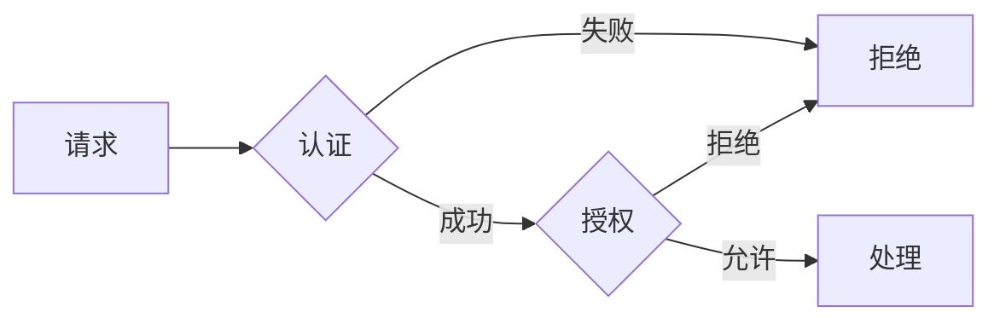

# Flink 2.4 安全增强 特性跟踪

> 所属阶段: Flink/roadmap | 前置依赖: [Security架构][^1] | 形式化等级: L3

## 1. 概念定义 (Definitions)

### Def-F-24-19: Authentication
身份验证定义为验证主体身份的过程：
$$
\text{AuthN}: \text{Credentials} \to \{\text{Success}, \text{Failure}\}
$$

### Def-F-24-20: Authorization
授权定义为访问控制决策：
$$
\text{AuthZ}: (\text{Subject}, \text{Resource}, \text{Action}) \to \{\text{Allow}, \text{Deny}\}
$$

## 2. 属性推导 (Properties)

### Prop-F-24-14: Security In-Depth
纵深防御要求多层保护：
$$
\text{Security} = \bigwedge_{i=1}^{n} L_i
$$

## 3. 关系建立 (Relations)

### 2.4安全特性

| 特性 | 描述 | 状态 |
|------|------|------|
| mTLS | 双向TLS认证 | GA |
| RBAC | 细粒度权限 | Beta |
| Secret管理 | K8s集成 | GA |
| 审计日志 | 操作审计 | 开发中 |

## 4. 论证过程 (Argumentation)

### 4.1 安全架构



## 5. 形式证明 / 工程论证

### 5.1 RBAC模型

**形式化定义**:
```
Permission ⊆ Role × Resource × Action
UserAssignment ⊆ User × Role
```

## 6. 实例验证 (Examples)

### 6.1 安全配置

```yaml
security:
  ssl.enabled: true
  ssl.algorithm: TLSv1.3
  
  authentication:
    type: kerberos
    
  authorization:
    enabled: true
    policy: rbac
```

## 7. 可视化 (Visualizations)



## 8. 引用参考 (References)

[^1]: Apache Flink Security Documentation

---

## 跟踪信息

| 属性 | 值 |
|------|-----|
| 目标版本 | Flink 2.4 |
| 当前状态 | 开发中 |
