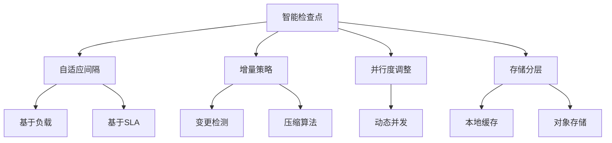
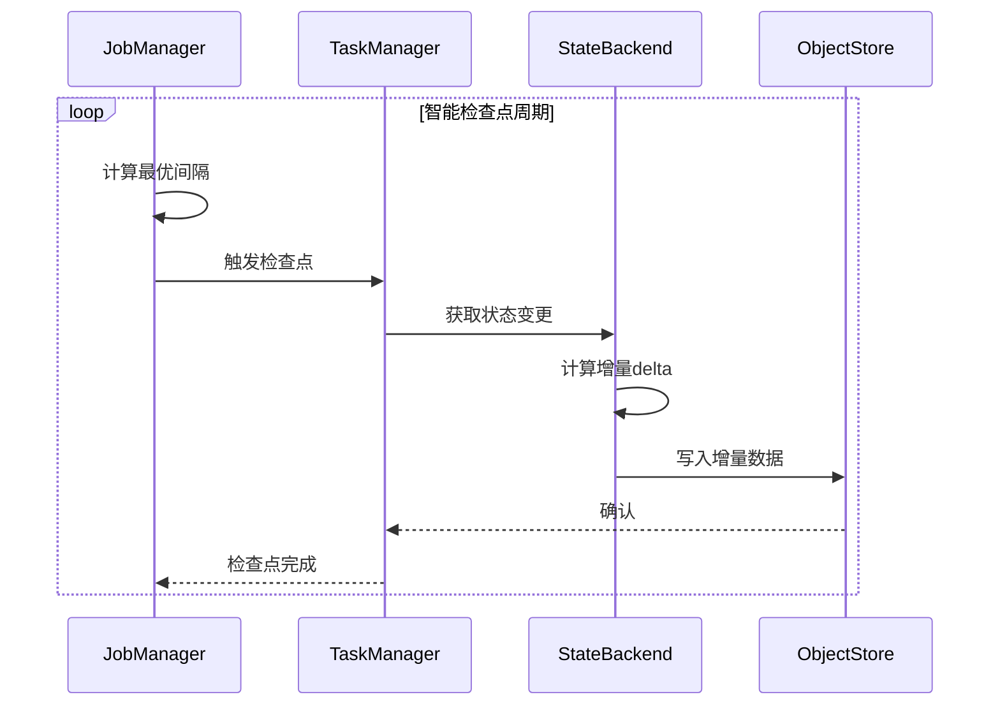

# Flink 2.4 智能检查点策略 特性跟踪

> 所属阶段: Flink/roadmap | 前置依赖: [Checkpoint机制][^1] | 形式化等级: L4

## 1. 概念定义 (Definitions)

### Def-F-24-07: Smart Checkpoint
智能检查点是指根据运行时状态动态调整检查点策略的机制：
$$
\text{CP}_{\text{config}}(t) = f(\text{StateSize}(t), \text{ChangeRate}(t), \text{RecoverySLA}(t))
$$

### Def-F-24-08: Incremental Checkpoint Delta
增量检查点差异定义为：
$$
\Delta_t = \text{State}_t \setminus \text{State}_{t-\Delta t}
$$

仅持久化 $\Delta_t$ 以减少I/O。

## 2. 属性推导 (Properties)

### Prop-F-24-07: Checkpoint Overhead Bound
智能检查点保证开销有上界：
$$
\text{Overhead}_{\text{cp}} \leq \alpha \cdot T_{\text{normal}} + \beta
$$

### Prop-F-24-08: Recovery Time Bound
恢复时间上界与状态大小关系：
$$
T_{\text{recovery}} \leq c_1 \cdot |\text{State}| + c_2 \cdot |\text{Log}|
$$

## 3. 关系建立 (Relations)

### 与存储后端的关系

| 后端 | 增量支持 | 智能特性 |
|------|----------|----------|
| RocksDB | ✅ 原生 | 文件级增量 |
| Heap | ⚠️ 受限 | 序列化增量 |
| ForSt | ✅ 优化 | 块级增量 |

## 4. 论证过程 (Argumentation)

### 4.1 智能策略类型



## 5. 形式证明 / 工程论证

### 5.1 最优间隔计算

**定理 (Thm-F-24-04)**: 最优检查点间隔最小化总成本。

**成本函数**:
$$
C(T) = \frac{C_{\text{cp}}}{T} + \lambda \cdot \frac{T}{2} \cdot C_{\text{rework}}
$$

其中：
- $C_{\text{cp}}$: 单次检查点成本
- $\lambda$: 故障率
- $C_{\text{rework}}$: 重放成本

求导得最优间隔：
$$
T^* = \sqrt{\frac{2 \cdot C_{\text{cp}}}{\lambda \cdot C_{\text{rework}}}}
$$

## 6. 实例验证 (Examples)

### 6.1 配置

```yaml
execution.checkpointing:
  mode: smart  # 启用智能检查点
  smart-config:
    adaptive-interval:
      enabled: true
      min: 1s
      max: 10min
      target-recovery-time: 30s
    incremental:
      enabled: true
      compression: zstd
      delta-threshold: 10%  # 增量阈值
```

## 7. 可视化 (Visualizations)



## 8. 引用参考 (References)

[^1]: Apache Flink Documentation, "Checkpointing", https://nightlies.apache.org/flink/flink-docs-stable/docs/dev/datastream/fault-tolerance/checkpointing/

---

## 跟踪信息

| 属性 | 值 |
|------|-----|
| 目标版本 | Flink 2.4 |
| 当前状态 | 设计阶段 |
