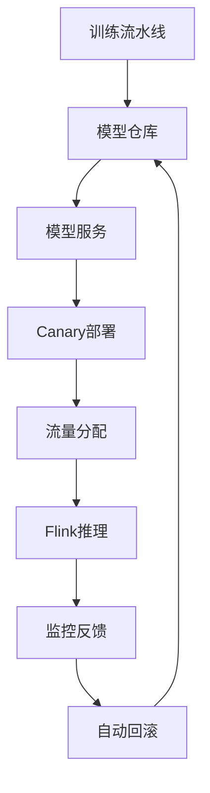
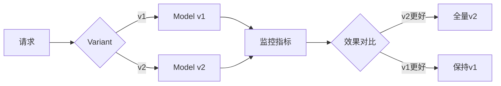

# Flink 2.5 AI/ML生产就绪 特性跟踪

> 所属阶段: Flink/roadmap | 前置依赖: [FLIP-531][^1] | 形式化等级: L4

## 1. 概念定义 (Definitions)

### Def-F-25-05: ML Production Ready
ML生产就绪定义为满足：
- 模型版本管理
- A/B测试支持
- 监控与回滚
- 性能SLA保证

### Def-F-25-06: Model Serving
模型服务定义为：
$$
\text{Serve}(M, x) = y \text{ where } M \text{ is model}, x \text{ is input}
$$

## 2. 属性推导 (Properties)

### Prop-F-25-04: Model Consistency
模型版本一致性：
$$
\forall r_1, r_2 \in \text{Requests}: \text{ModelVersion}(r_1) = \text{ModelVersion}(r_2)
$$

## 3. 关系建立 (Relations)

### ML生态集成

| 组件 | 集成方式 | 状态 |
|------|----------|------|
| MLflow | 模型注册 | Beta |
| Ray Serve | 分布式推理 | Beta |
| TensorFlow Serving | gRPC调用 | GA |
| TorchServe | HTTP调用 | Beta |

## 4. 论证过程 (Argumentation)

### 4.1 生产级ML架构



## 5. 形式证明 / 工程论证

### 5.1 A/B测试框架

```java
public class ABTestInference extends ProcessFunction<Event, Result> {
    private Map<String, Model> modelVersions;
    
    @Override
    public void processElement(Event event, Context ctx, Collector<Result> out) {
        String variant = assignVariant(event.getUserId());
        Model model = modelVersions.get(variant);
        Result result = model.predict(event);
        result.setVariant(variant);
        out.collect(result);
    }
}
```

## 6. 实例验证 (Examples)

### 6.1 ML配置

```yaml
ml.serving:
  model-registry: mlflow
  inference:
    batch-size: 32
    timeout: 100ms
  ab-test:
    enabled: true
    variants:
      - v1: 90%
      - v2: 10%
```

## 7. 可视化 (Visualizations)



## 8. 引用参考 (References)

[^1]: FLIP-531 AI Agents

---

## 跟踪信息

| 属性 | 值 |
|------|-----|
| 目标版本 | Flink 2.5 |
| 当前状态 | 规划阶段 |
