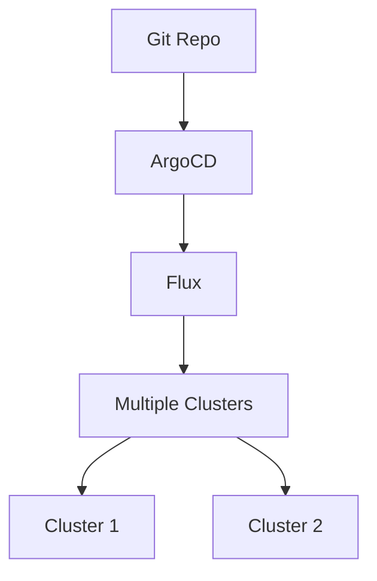

# Flink 2.5 部署改进 特性跟踪

> 所属阶段: Flink/roadmap | 前置依赖: [2.4 Deployment][^1] | 形式化等级: L3

## 1. 概念定义 (Definitions)

### Def-F-25-15: GitOps Deployment
GitOps部署定义为：
$$
\text{DesiredState} = f(\text{GitRepository}), \text{ActualState} \to \text{DesiredState}
$$

## 2. 属性推导 (Properties)

### Prop-F-25-11: Declarative Consistency
声明式配置一致性：
$$
\text{Git} \equiv \text{Actual} \text{ (eventually)}
$$

## 3. 关系建立 (Relations)

### 部署改进

| 特性 | 描述 | 状态 |
|------|------|------|
| ArgoCD集成 | GitOps支持 | Beta |
| Terraform Provider | IaC支持 | GA |
| 配置验证 | 预部署检查 | 开发中 |
| 多集群管理 | 联邦部署 | Beta |

## 4. 论证过程 (Argumentation)

### 4.1 GitOps架构



## 5. 形式证明 / 工程论证

### 5.1 一致性保证

**定理**: GitOps保证状态最终一致性。

## 6. 实例验证 (Examples)

### 6.1 ArgoCD配置

```yaml
apiVersion: argoproj.io/v1alpha1
kind: Application
metadata:
  name: flink-job
spec:
  source:
    repoURL: https://github.com/org/flink-jobs
    path: jobs/analytics
  destination:
    server: https://kubernetes.default.svc
```

## 7. 可视化 (Visualizations)


## 8. 引用参考 (References)

[^1]: Flink 2.4 Deployment

---

## 跟踪信息

| 属性 | 值 |
|------|-----|
| 目标版本 | Flink 2.5 |
| 当前状态 | 设计阶段 |
