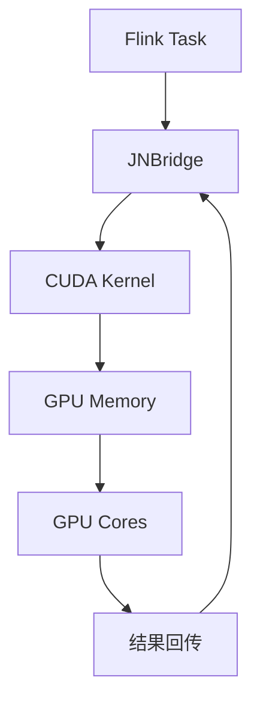
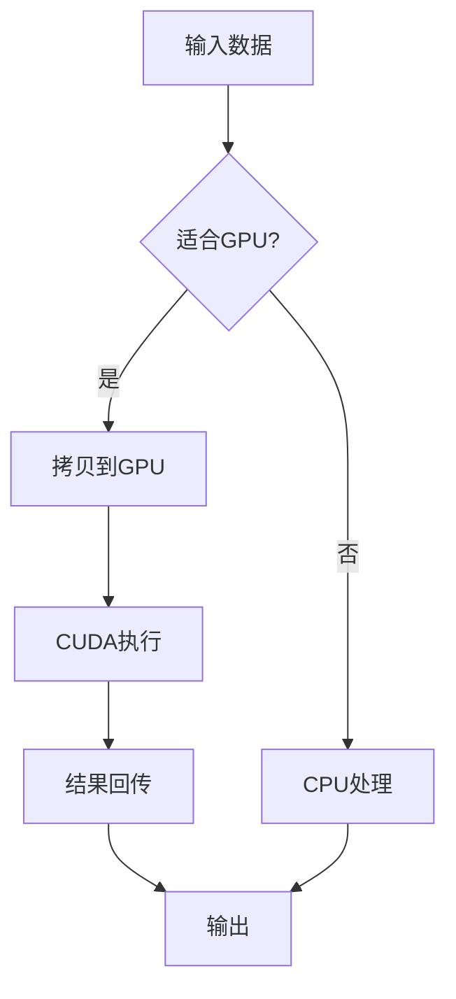

# Flink 2.5 GPU加速算子 特性跟踪

> 所属阶段: Flink/roadmap | 前置依赖: [GPU Support][^1] | 形式化等级: L4

## 1. 概念定义 (Definitions)

### Def-F-25-07: GPU Acceleration
GPU加速定义为将计算密集型算子卸载到GPU执行：
$$
\text{Speedup} = \frac{T_{\text{CPU}}}{T_{\text{GPU}}} \gg 1
$$

### Def-F-25-08: CUDA Operator
CUDA算子定义为使用NVIDIA CUDA编程模型实现的Flink算子。

## 2. 属性推导 (Properties)

### Prop-F-25-05: Memory Transfer Overhead
数据传输开销必须小于计算收益：
$$
T_{\text{transfer}} + T_{\text{compute}}^{\text{GPU}} < T_{\text{compute}}^{\text{CPU}}
$$

## 3. 关系建立 (Relations)

### 加速场景

| 算子 | 加速比 | 适用条件 |
|------|--------|----------|
| 矩阵乘法 | 10-50x | 大矩阵 |
| CNN推理 | 5-20x | 批量大 |
| 向量搜索 | 3-10x | 高维向量 |
| 图像处理 | 10-30x | 高分辨率 |

## 4. 论证过程 (Argumentation)

### 4.1 GPU集成架构



## 5. 形式证明 / 工程论证

### 5.1 加速比分析

**定理 (Thm-F-25-02)**: GPU加速比与数据大小相关。

**证明**:
设 $n$ 为数据大小，$T_{\text{transfer}} = \alpha n$，$T_{\text{compute}}^{\text{CPU}} = \beta n$。

GPU计算时间：$T_{\text{compute}}^{\text{GPU}} = \frac{\beta n}{k}$，其中 $k$ 为并行度。

加速比：
$$
S = \frac{\beta n}{\alpha n + \frac{\beta n}{k}} = \frac{\beta}{\alpha + \frac{\beta}{k}}
$$

当 $n \to \infty$，$S \to \frac{\beta}{\alpha}$。

## 6. 实例验证 (Examples)

### 6.1 GPU算子

```java
public class GPUMatrixMul extends RichMapFunction<Matrix, Matrix> {
    private transient CudaContext cuda;
    
    @Override
    public void open(Configuration parameters) {
        cuda = new CudaContext();
        cuda.loadKernel("matrix_mul");
    }
    
    @Override
    public Matrix map(Matrix value) {
        return cuda.execute(value);
    }
}
```

## 7. 可视化 (Visualizations)



## 8. 引用参考 (References)

[^1]: NVIDIA CUDA Programming Guide

---

## 跟踪信息

| 属性 | 值 |
|------|-----|
| 目标版本 | Flink 2.5 |
| 当前状态 | 设计阶段 |
