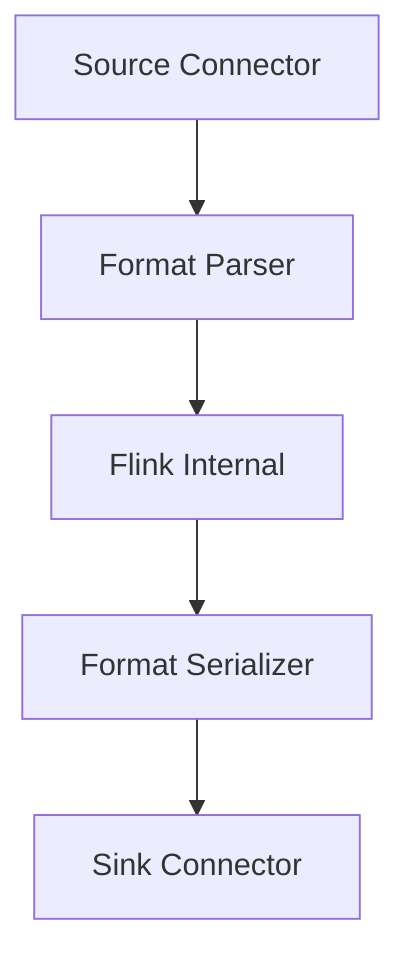
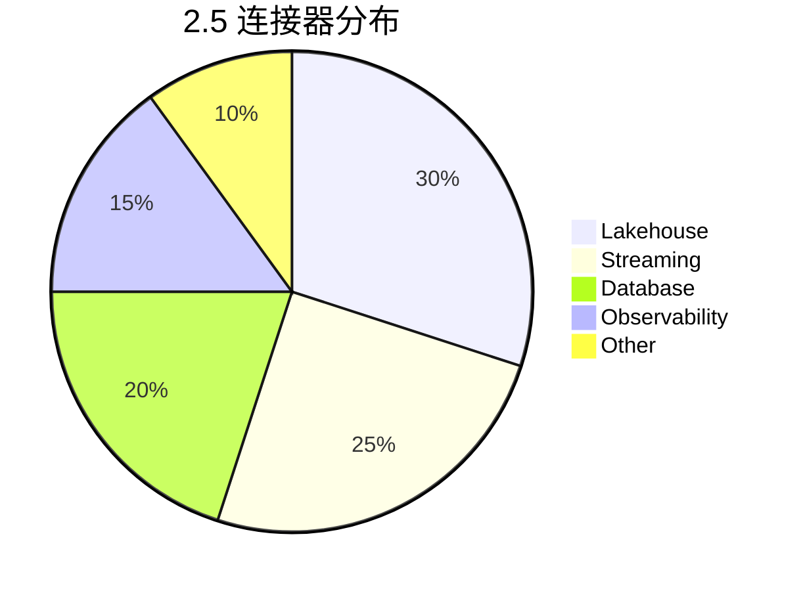

# Flink 2.5 新连接器 特性跟踪

> 所属阶段: Flink/roadmap | 前置依赖: [Connector Framework][^1] | 形式化等级: L3

## 1. 概念定义 (Definitions)

### Def-F-25-13: Connector Ecosystem
连接器生态系统定义为所有输入输出适配器的集合：
$$
\text{Ecosystem} = \{(S_i, T_i) | S_i \in \text{Sources}, T_i \in \text{Sinks}\}
$$

## 2. 属性推导 (Properties)

### Prop-F-25-09: Connector Interoperability
连接器互操作性：
$$
\forall C_1, C_2 : \text{DataFormat}(C_1) \cap \text{DataFormat}(C_2) \neq \emptyset
$$

## 3. 关系建立 (Relations)

### 2.5新连接器

| 连接器 | 类型 | 状态 |
|--------|------|------|
| Apache Polaris | Catalog | Beta |
| Databricks Delta | Lakehouse | GA |
| Apache XTable | 格式转换 | Beta |
| DataDog | Observability | GA |
| NewRelic | APM | GA |
| Splunk | SIEM | Beta |

## 4. 论证过程 (Argumentation)

### 4.1 连接器架构



## 5. 形式证明 / 工程论证

### 5.1 格式转换一致性

**定理**: XTable连接器保持跨格式语义等价。

## 6. 实例验证 (Examples)

### 6.1 Delta Lake配置

```sql
CREATE TABLE delta_table WITH (
    'connector' = 'delta-lake',
    'table-path' = 's3://bucket/delta',
    'version' = 'latest'
);
```

## 7. 可视化 (Visualizations)



## 8. 引用参考 (References)

[^1]: Apache Flink Connectors

---

## 跟踪信息

| 属性 | 值 |
|------|-----|
| 目标版本 | Flink 2.5 |
| 当前状态 | 规划阶段 |
