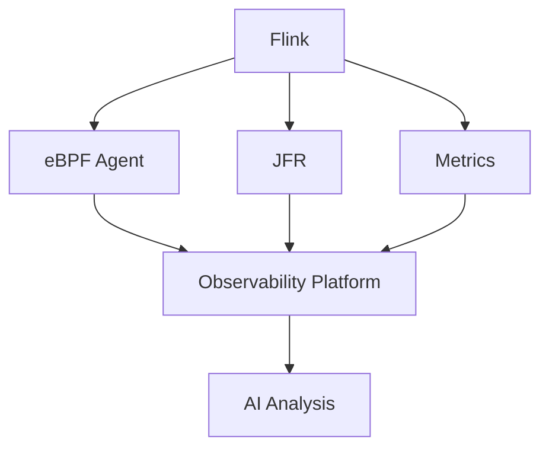
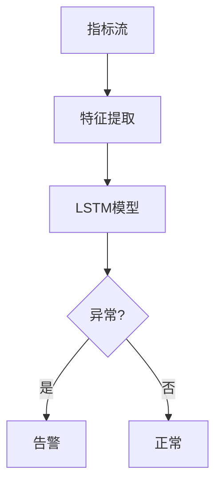

# Flink 2.5 可观测性 特性跟踪

> 所属阶段: Flink/roadmap | 前置依赖: [2.4 Observability][^1] | 形式化等级: L3

## 1. 概念定义 (Definitions)

### Def-F-25-16: Unified Observability
统一可观测性定义为：
$$
\text{Observability} = \text{Metrics} \times \text{Logs} \times \text{Traces} \times \text{Profiles}
$$

## 2. 属性推导 (Properties)

### Prop-F-25-12: Correlation
可观测性数据关联性：
$$
\forall m \in \text{Metrics}, \exists l \in \text{Logs}, t \in \text{Traces} : \text{Correlated}(m, l, t)
$$

## 3. 关系建立 (Relations)

### 可观测性改进

| 特性 | 描述 | 状态 |
|------|------|------|
| eBPF集成 | 内核级监控 | Beta |
| 持续剖析 | CPU分析 | GA |
| 异常检测 | ML驱动告警 | Beta |
| 成本洞察 | 资源成本分析 | 开发中 |

## 4. 论证过程 (Argumentation)

### 4.1 可观测性平台



## 5. 形式证明 / 工程论证

### 5.1 异常检测

```python
# 基于LSTM的异常检测
class AnomalyDetector:
    def detect(self, metrics):
        prediction = self.lstm.predict(metrics)
        anomaly_score = abs(prediction - metrics)
        return anomaly_score > threshold
```

## 6. 实例验证 (Examples)

### 6.1 配置

```yaml
observability:
  ebpf.enabled: true
  profiling.continuous: true
  anomaly-detection.enabled: true
```

## 7. 可视化 (Visualizations)



## 8. 引用参考 (References)

[^1]: Flink 2.4 Observability

---

## 跟踪信息

| 属性 | 值 |
|------|-----|
| 目标版本 | Flink 2.5 |
| 当前状态 | 规划阶段 |
