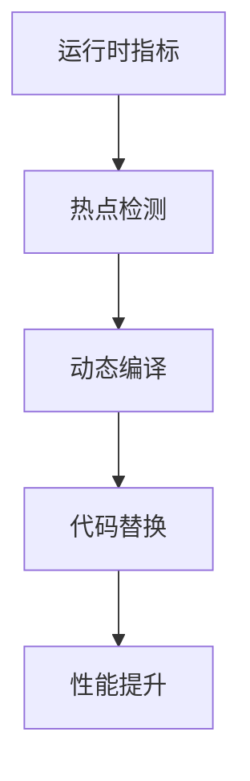

# Flink 2.5 性能优化 特性跟踪

> 所属阶段: Flink/roadmap | 前置依赖: [2.4 Performance][^1] | 形式化等级: L3

## 1. 概念定义 (Definitions)

### Def-F-25-14: Performance Target
2.5性能目标定义为：
- TPC-DS: 提升50%
- TPC-H: 提升40%
- 流处理延迟: <10ms P99

## 2. 属性推导 (Properties)

### Prop-F-25-10: Scaling Efficiency
扩展效率：
$$
\eta_{\text{scale}} = \frac{T(1)}{P \cdot T(P)} \geq 0.9
$$

## 3. 关系建立 (Relations)

### 性能优化特性

| 特性 | 目标 | 预期提升 |
|------|------|----------|
| 自适应编译 | JIT优化 | 30% |
| 向量化执行V2 | SIMD优化 | 2x |
| 网络压缩 | 传输优化 | 40% |
| 内存池化 | GC优化 | 50% |

## 4. 论证过程 (Argumentation)

### 4.1 自适应编译



## 5. 形式证明 / 工程论证

### 5.1 JIT优化效果

**定理**: 自适应JIT编译可提升热点代码性能2-10x。

## 6. 实例验证 (Examples)

### 6.1 配置

```yaml
execution:
  jit.enabled: true
  jit.threshold: 10000
  vectorized.v2.enabled: true
```

## 7. 可视化 (Visualizations)

```mermaid
bar title 2.5 性能目标
    y-axis 提升比例 --> 0 --> 60
    x-axis [TPC-DS, TPC-H, 流延迟, 扩展性]
    bar [50, 40, -50, 10]
```

## 8. 引用参考 (References)

[^1]: Flink 2.4 Performance

---

## 跟踪信息

| 属性 | 值 |
|------|-----|
| 目标版本 | Flink 2.5 |
| 当前状态 | 规划阶段 |
