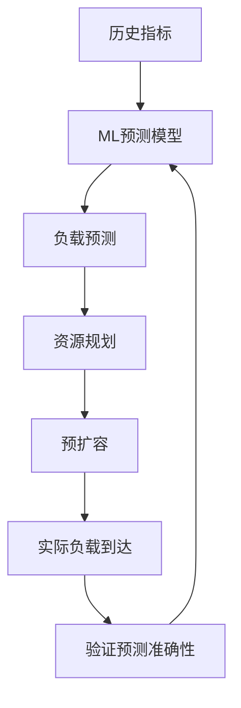
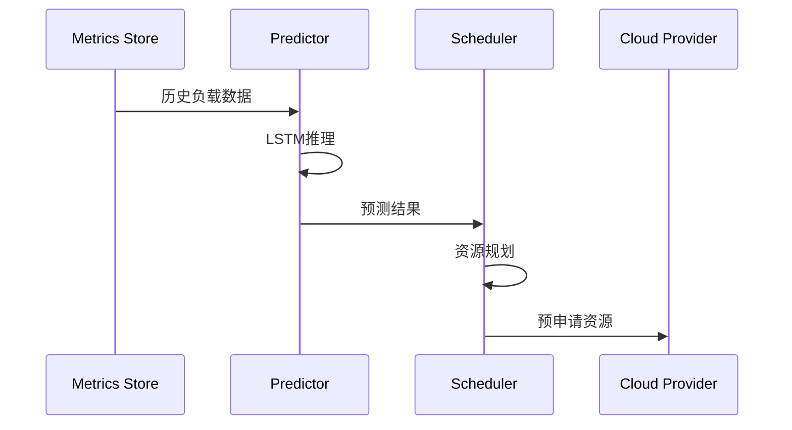

# Flink 2.5 Serverless V2 特性跟踪

> 所属阶段: Flink/roadmap | 前置依赖: [Flink 2.4 Serverless][^1] | 形式化等级: L4

## 1. 概念定义 (Definitions)

### Def-F-25-03: Serverless V2
Serverless V2是Flink 2.4 Serverless的成熟版本，具备：
- 预测性扩缩容
- 成本感知调度
- 多云抽象层
- 边缘计算支持

### Def-F-25-04: Predictive Autoscaling
预测性扩缩容使用ML预测负载变化：
$$
P(t + \Delta t) = f(\text{History}_{[t-T, t]}, \text{Pattern})
$$

## 2. 属性推导 (Properties)

### Prop-F-25-03: Cost Optimality
成本优化目标：
$$
\min \int_0^T C(P(t)) dt \quad \text{s.t.} \quad L(t) \leq L_{\text{max}}
$$

## 3. 关系建立 (Relations)

### V2 vs V1对比

| 特性 | V1 (2.4) | V2 (2.5) |
|------|----------|----------|
| 扩容响应 | 反应式 | 预测式 |
| 成本优化 | 基础 | 智能 |
| 多云支持 | 单一云 | 多云抽象 |
| 边缘支持 | 无 | 有 |

## 4. 论证过程 (Argumentation)

### 4.1 预测性扩缩容



## 5. 形式证明 / 工程论证

### 5.1 LSTM预测模型

```python
# 预测模型架构
class LoadPredictor(nn.Module):
    def __init__(self):
        self.lstm = nn.LSTM(input_size=10, hidden_size=64)
        self.fc = nn.Linear(64, 1)
    
    def forward(self, x):
        lstm_out, _ = self.lstm(x)
        return self.fc(lstm_out)
```

## 6. 实例验证 (Examples)

### 6.1 配置

```yaml
serverless.v2:
  predictive.enabled: true
  prediction.horizon: 5min
  cost.optimizer:
    enabled: true
    strategy: spot-first
```

## 7. 可视化 (Visualizations)



## 8. 引用参考 (References)

[^1]: Flink 2.4 Serverless GA

---

## 跟踪信息

| 属性 | 值 |
|------|-----|
| 目标版本 | Flink 2.5 |
| 当前状态 | 设计阶段 |
