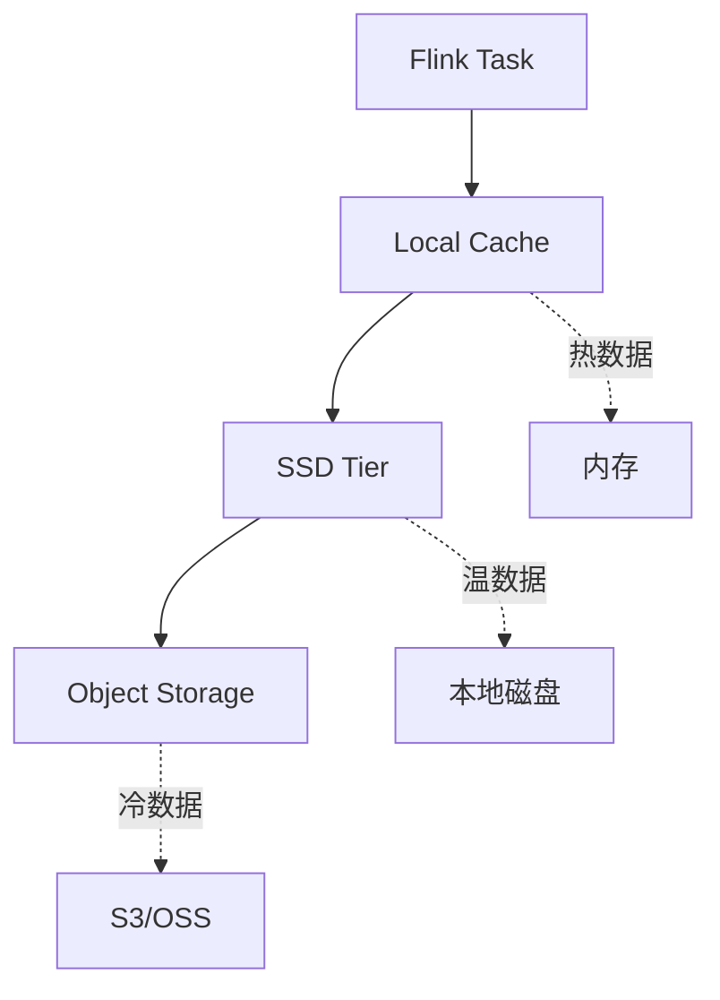
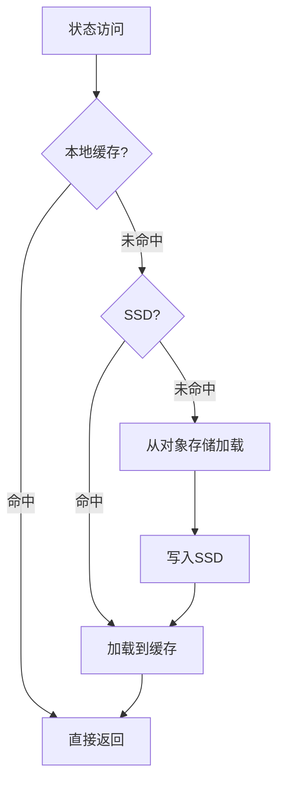

# Flink 2.5 新型存储后端 特性跟踪

> 所属阶段: Flink/roadmap | 前置依赖: [State Backends][^1] | 形式化等级: L3

## 1. 概念定义 (Definitions)

### Def-F-25-11: Tiered Storage
分层存储定义：
$$
\text{Storage} = L_1(\text{Local}) \cup L_2(\text{Remote}) \cup L_3(\text{Cold})
$$

### Def-F-25-12: Disaggregated State
分离式状态存储将计算与状态分离：
$$
\text{Task} \perp \text{State} : \text{Fail}(\text{Task}) \not\Rightarrow \text{Fail}(\text{State})
$$

## 2. 属性推导 (Properties)

### Prop-F-25-08: State Migration
状态可独立于Task迁移：
$$
\text{State}_i \xrightarrow{\text{Migration}} \text{State}_j, \forall i, j
$$

## 3. 关系建立 (Relations)

### 存储后端对比

| 后端 | 延迟 | 容量 | 成本 |
|------|------|------|------|
| RocksDB | 低 | 中 | 中 |
| ForSt | 低 | 高 | 中 |
| Remote SSD | 中 | 高 | 低 |
| Object Storage | 高 | 无限 | 极低 |

## 4. 论证过程 (Argumentation)

### 4.1 分层存储架构



## 5. 形式证明 / 工程论证

### 5.1 分层访问策略

```
if hit(local_cache):
    return local_cache.get(key)
elif hit(ssd_tier):
    value = ssd_tier.get(key)
    local_cache.put(key, value)
    return value
else:
    value = object_storage.get(key)
    ssd_tier.put(key, value)
    return value
```

## 6. 实例验证 (Examples)

### 6.1 配置

```yaml
state.backend: tiered
state.tiered:
  memory-tier: 1gb
  local-tier: 10gb
  remote-tier: unlimited
  remote.uri: s3://bucket/state
```

## 7. 可视化 (Visualizations)



## 8. 引用参考 (References)

[^1]: Apache Flink State Backends

---

## 跟踪信息

| 属性 | 值 |
|------|-----|
| 目标版本 | Flink 2.5 |
| 当前状态 | 设计阶段 |
