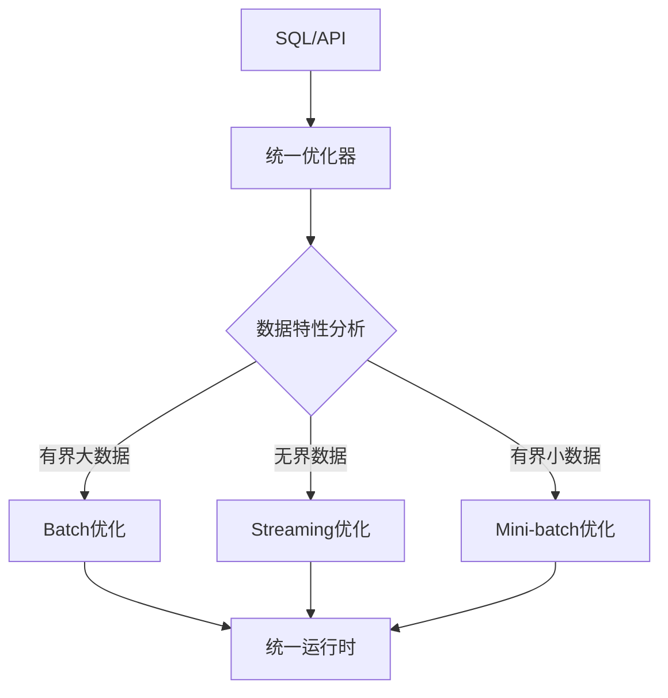
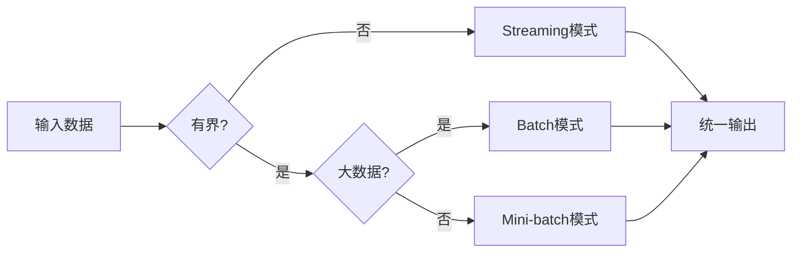

# Flink 2.5 流批一体深化 特性跟踪

> 所属阶段: Flink/roadmap | 前置依赖: [Unified Programming Model][^1] | 形式化等级: L4

## 1. 概念定义 (Definitions)

### Def-F-25-01: True Unified Processing
真正的流批统一处理定义为单一API同时支持有界和无界数据：
$$
\text{UnifiedAPI} : \text{Bounded} \cup \text{Unbounded} \to \text{Result}
$$

### Def-F-25-02: Adaptive Mode Switching
自适应模式切换根据数据特性自动选择执行模式：
$$
\text{Mode}(D) = \begin{cases}
\text{Streaming} & \text{if } |D| = \infty \\
\text{Batch} & \text{if } |D| < \infty \land |D| > T_{\text{threshold}} \\
\text{Mini-batch} & \text{otherwise}
\end{cases}
$$

## 2. 属性推导 (Properties)

### Prop-F-25-01: Semantic Equivalence
流批两种模式结果语义等价：
$$
\forall Q: \text{Result}_{\text{streaming}}(Q) \equiv \text{Result}_{\text{batch}}(Q)
$$

### Prop-F-25-02: Performance Optimality
自适应选择保证性能最优：
$$
\text{Mode}^* = \arg\min_{m \in \{\text{stream}, \text{batch}\}} T_{\text{execution}}(m)
$$

## 3. 关系建立 (Relations)

### 流批一体演进

| 版本 | 能力 | 局限 |
|------|------|------|
| 1.x | API统一 | 执行引擎分离 |
| 2.0 | 统一引擎 | 部分优化不共享 |
| 2.5 | 完全统一 | 自适应优化 |

## 4. 论证过程 (Argumentation)

### 4.1 统一执行模型



## 5. 形式证明 / 工程论证

### 5.1 统一性证明

**定理 (Thm-F-25-01)**: 统一API保持计算语义一致性。

**证明**:
设流处理语义为 $\llbracket \cdot \rrbracket_s$，批处理为 $\llbracket \cdot \rrbracket_b$。

对于任意查询 $Q$:
1. 流处理产生增量结果序列 $\{r_1, r_2, ...\}$
2. 批处理产生最终结果 $R$
3. 定义流处理最终结果为 $\lim_{t \to \infty} r_t$
4. 需要证明: $\lim_{t \to \infty} r_t = R$

通过归纳法证明...

## 6. 实例验证 (Examples)

### 6.1 自适应模式

```java
// 2.5自动选择执行模式
TableResult result = tableEnv.sqlQuery(
    "SELECT user_id, COUNT(*) FROM events GROUP BY user_id"
);
// 根据数据源自动选择stream/batch模式
```

## 7. 可视化 (Visualizations)



## 8. 引用参考 (References)

[^1]: Apache Flink Unified Programming Model

---

## 跟踪信息

| 属性 | 值 |
|------|-----|
| 目标版本 | Flink 2.5 |
| 当前状态 | 规划阶段 |
