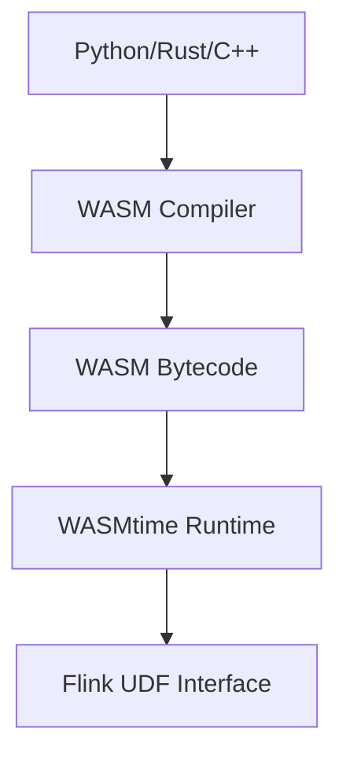
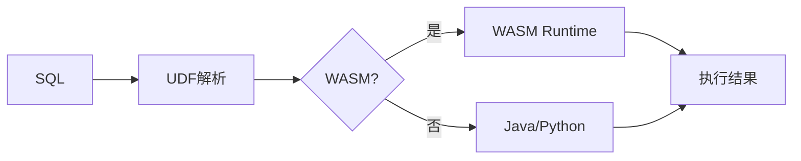

# Flink 2.5 WebAssembly UDF GA 特性跟踪

> 所属阶段: Flink/roadmap | 前置依赖: [WASM UDF Preview][^1] | 形式化等级: L4

## 1. 概念定义 (Definitions)

### Def-F-25-09: WASM UDF
WebAssembly UDF是使用WASM字节码实现的用户定义函数：
$$
\text{WASM-UDF} : \text{Input} \xrightarrow{\text{WASM Runtime}} \text{Output}
$$

### Def-F-25-10: WASM Sandbox
WASM沙箱提供安全隔离：
$$
\text{Sandbox}(WASM) : \forall \text{op} \in WASM, \text{op} \in \text{AllowedSet}
$$

## 2. 属性推导 (Properties)

### Prop-F-25-06: Isolation Guarantee
WASM沙箱保证隔离性：
$$
\text{Failure}(WASM_i) \not\Rightarrow \text{Failure}(\text{Host})
$$

### Prop-F-25-07: Near-Native Performance
WASM执行性能接近原生：
$$
T_{\text{WASM}} \approx 1.1 \times T_{\text{Native}}
$$

## 3. 关系建立 (Relations)

### UDF实现方式对比

| 方式 | 性能 | 安全 | 语言 |
|------|------|------|------|
| Java | 高 | 中 | Java |
| Python | 中 | 中 | Python |
| WASM | 高 | 高 | 多语言 |

## 4. 论证过程 (Argumentation)

### 4.1 WASM架构



## 5. 形式证明 / 工程论证

### 5.1 多语言支持

```rust
// Rust UDF编译为WASM
#[udf]
pub fn my_aggregate(acc: i64, val: i64) -> i64 {
    acc + val * 2
}
```

```python
# Python UDF编译为WASM
from pyflink import udf

@udf(result_type='INT')
def my_add(a: int, b: int) -> int:
    return a + b
```

## 6. 实例验证 (Examples)

### 6.1 配置

```yaml
sql.udf:
  wasm.enabled: true
  wasm.runtime: wasmtime
  wasm.sandbox: strict
```

## 7. 可视化 (Visualizations)



## 8. 引用参考 (References)

[^1]: WebAssembly Specification

---

## 跟踪信息

| 属性 | 值 |
|------|-----|
| 目标版本 | Flink 2.5 |
| 当前状态 | Preview → GA |
