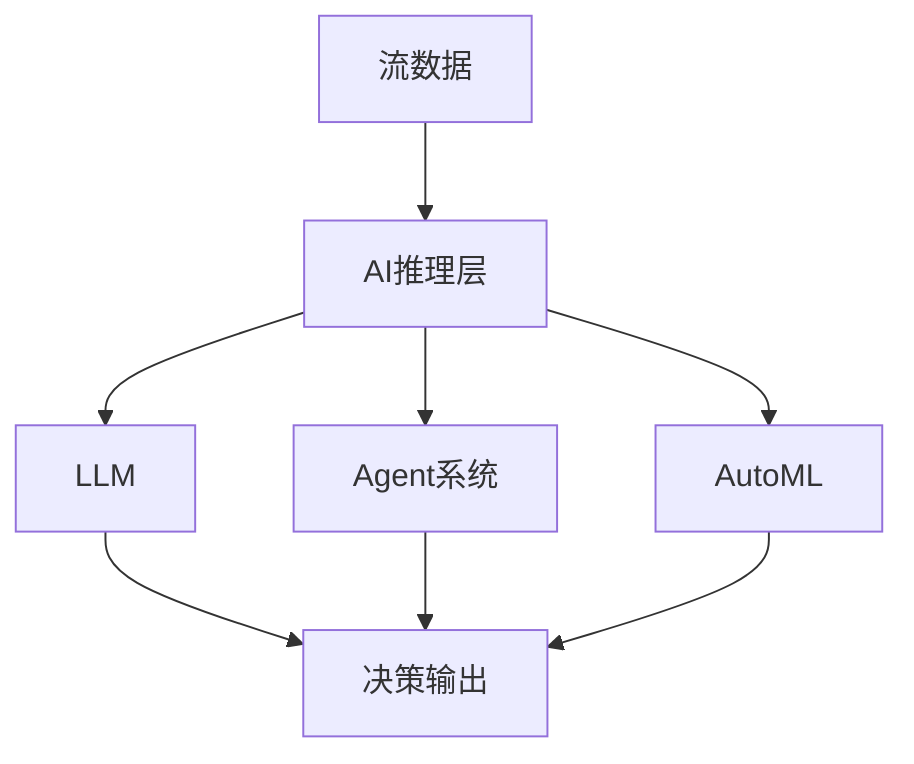
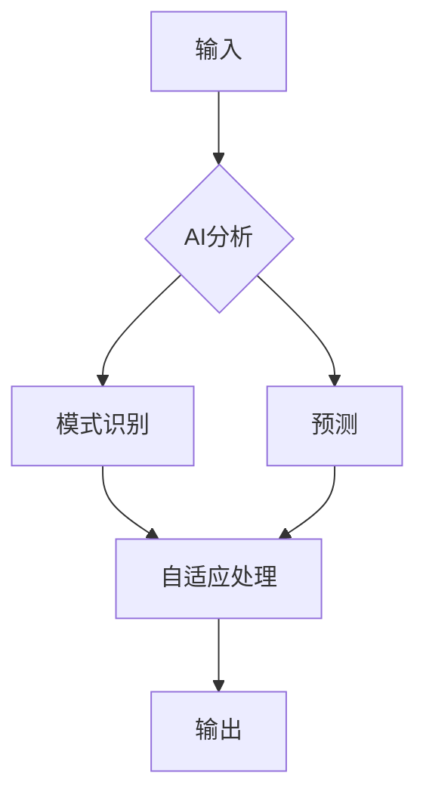

# Flink 3.0 AI原生支持 特性跟踪

> 所属阶段: Flink/roadmap | 前置依赖: [FLIP-531][^1] | 形式化等级: L5

## 1. 概念定义 (Definitions)

### Def-F-30-19: AI-Native Streaming

AI原生流处理定义为内置AI能力的流系统：
$$
\text{Streaming}_{\text{AI}} = \text{Streaming} \times \text{AI}
$$

### Def-F-30-20: Agentic Workflow

智能体工作流：
$$
\text{Workflow} = \{ ext{Agent}_i\}_{i=1}^n \text{ with } \text{Coordination}
$$

## 2. 属性推导 (Properties)

### Prop-F-30-13: Adaptive Intelligence

自适应智能：
$$
\text{Behavior}_{t+1} = \text{Behavior}_t + \alpha \cdot \nabla \text{Reward}
$$

## 3. 关系建立 (Relations)

### AI原生特性

| 特性 | 描述 | 状态 |
|------|------|------|
| 内置LLM | 原生大模型支持 | 愿景 |
| 智能优化器 | AI驱动查询优化 | 规划 |
| 自治运维 | 自修复系统 | 愿景 |
| 多智能体 | 协作Agent系统 | 研究 |

## 4. 论证过程 (Argumentation)

### 4.1 AI原生架构



## 5. 形式证明 / 工程论证

### 5.1 智能优化器

```java
public class AIOptimizer {
    public ExecutionPlan optimize(LogicalPlan plan) {
        // 使用RL模型选择最优计划
        return rlModel.selectBestPlan(plan);
    }
}
```

## 6. 实例验证 (Examples)

### 6.1 AI原生SQL

```sql
-- AI驱动的异常检测
SELECT *,
    AI_DETECT_ANOMALY(
        features => [temperature, pressure],
        model => 'anomaly_v2'
    ) as is_anomaly
FROM sensor_data;

-- LLM文本分析
SELECT
    user_id,
    LLM_EXTRACT_INTENT(message) as intent
FROM chat_messages;
```

## 7. 可视化 (Visualizations)



## 8. 引用参考 (References)

[^1]: FLIP-531 AI Agents

---

## 跟踪信息

| 属性 | 值 |
|------|-----|
| 目标版本 | Flink 3.0 |
| 当前状态 | 愿景/研究阶段 |
