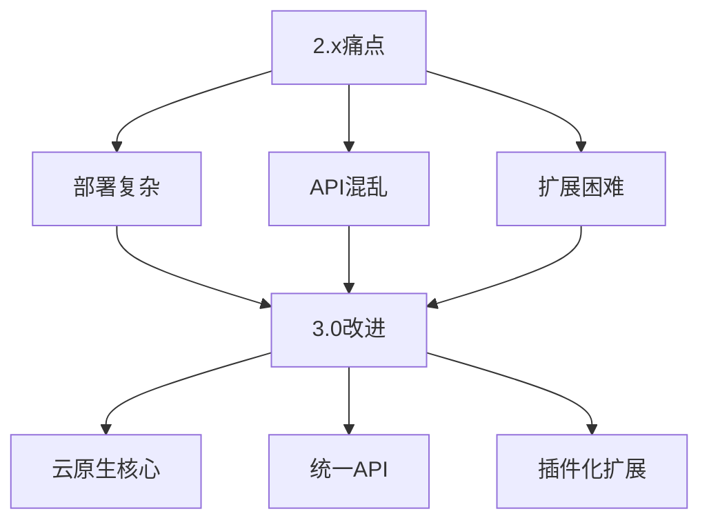
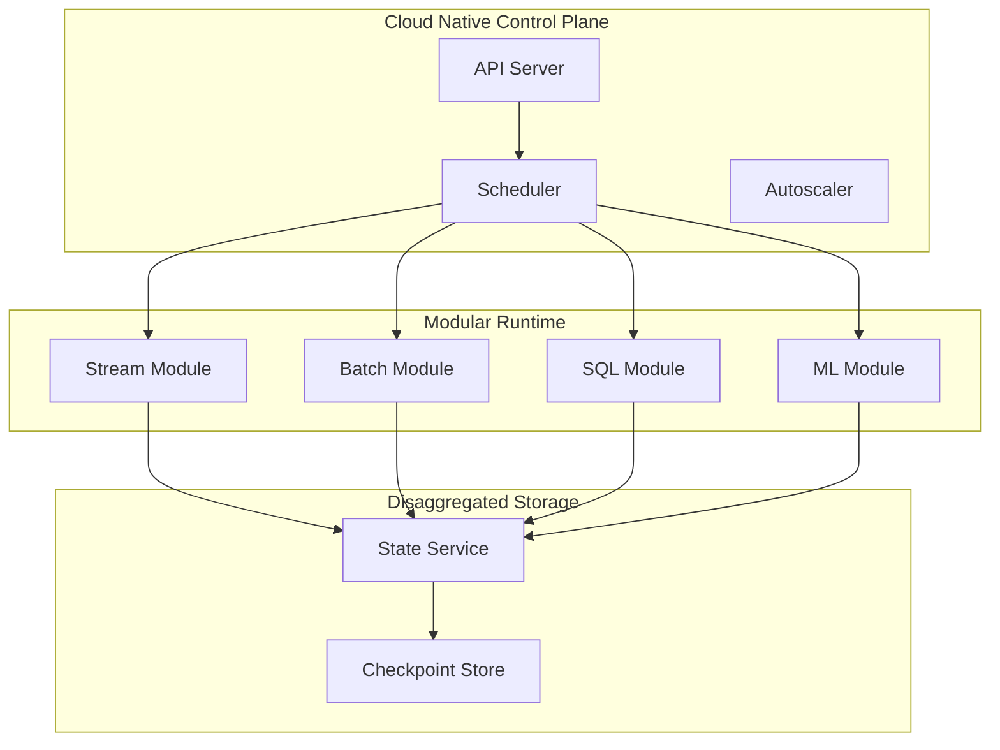
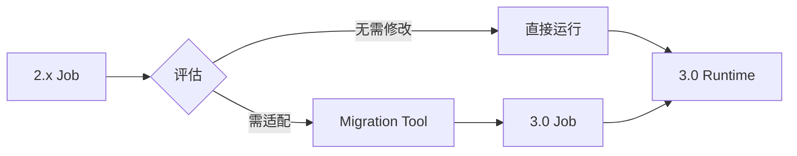

# Flink 3.0 架构重大变更 特性跟踪

> 所属阶段: Flink/roadmap | 前置依赖: [Flink Architecture][^1] | 形式化等级: L5

## 1. 概念定义 (Definitions)

### Def-F-30-01: Modular Architecture
模块化架构定义为组件松耦合、可独立演进的系统结构：
$$
\text{System} = \bigoplus_{i=1}^{n} \text{Module}_i, \text{ s.t. } \text{Coupling}(M_i, M_j) \leq \epsilon
$$

### Def-F-30-02: Cloud-Native Core
云原生核心定义：
- 容器优先设计
- 声明式API
- 弹性伸缩
- 可观测性内置

## 2. 属性推导 (Properties)

### Prop-F-30-01: Backward Compatibility
向后兼容性边界：
$$
\text{API}_{3.0} \supseteq \text{API}_{2.x} \cap \text{DeprecationSet}
$$

### Prop-F-30-02: Migration Path
迁移路径存在性：
$$
\forall \text{Job}_{2.x}, \exists \text{Transformation} : \text{Job}_{2.x} \to \text{Job}_{3.0}
$$

## 3. 关系建立 (Relations)

### 架构演进对比

| 维度 | 2.x | 3.0 |
|------|-----|-----|
| 核心设计 | 单体 | 模块化 |
| 部署 | 多模式 | 云原生优先 |
| API | 多层 | 统一简化 |
| 状态 | 紧耦合 | 分离式 |

## 4. 论证过程 (Argumentation)

### 4.1 架构重构动机



### 4.2 模块化边界

```
┌─────────────────────────────────────────┐
│           flink-core                    │
│  (最小运行时: Scheduler + Network)      │
├─────────────────────────────────────────┤
│  flink-streaming │ flink-batch         │
│  flink-sql       │ flink-ml            │
├─────────────────────────────────────────┤
│  Connectors │ State Backends │ Formats │
└─────────────────────────────────────────┘
```

## 5. 形式证明 / 工程论证

### 5.1 模块化正确性

**定理 (Thm-F-30-01)**: 模块化架构保持系统行为一致性。

**证明概要**:
设系统 $S$ 分解为模块 $\{M_1, ..., M_n\}$。

对于任意输入 $x$:
1. $S(x) = M_n(...M_2(M_1(x))...)$
2. 模块接口契约保证 $M_i^{\text{pre}} \Rightarrow M_i^{\text{post}}$
3. 通过组合推理，$S(x)$ 行为确定

### 5.2 云原生核心设计

```java
// 云原生Flink核心
public interface CloudNativeFlink {
    /**
     * 声明式作业提交
     */
    JobHandle submit(JobSpec spec);
    
    /**
     * 弹性扩缩容
     */
    CompletableFuture<Void> scale(JobHandle job, int parallelism);
    
    /**
     * 状态分离接口
     */
    StateHandle connectStateBackend(StateBackendSpec spec);
}
```

## 6. 实例验证 (Examples)

### 6.1 声明式作业定义

```yaml
apiVersion: flink.apache.org/v3
kind: FlinkJob
metadata:
  name: streaming-analytics
spec:
  mode: streaming
  parallelism: auto  # 自动扩缩容
  
  source:
    type: kafka
    config:
      bootstrap.servers: kafka:9092
      topics: [events]
  
  transformation:
    sql: |
      SELECT user_id, COUNT(*) 
      FROM events 
      GROUP BY user_id
  
  sink:
    type: iceberg
    config:
      warehouse: s3://warehouse
  
  resources:
    min: 2
    max: 100
    targetUtilization: 0.7
```

## 7. 可视化 (Visualizations)

### 3.0架构图



### 迁移路径



## 8. 引用参考 (References)

[^1]: Apache Flink Architecture Discussion, 2024.
[^2]: "Cloud-Native Streaming Systems", SIGMOD 2024.

---

## 跟踪信息

| 属性 | 值 |
|------|-----|
| FLIP编号 | FLIP-XXX (待创建) |
| 目标版本 | Flink 3.0 |
| 当前状态 | 愿景/设计阶段 |
| 预计发布 | 2026 |
| 破坏性变更 | 是 |
| 迁移工具 | 计划提供 |
