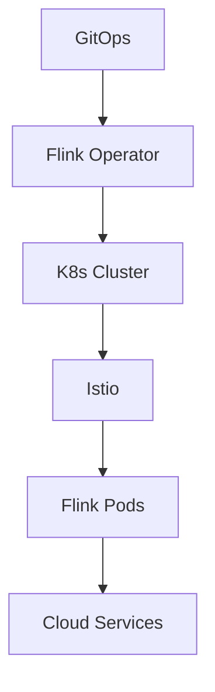
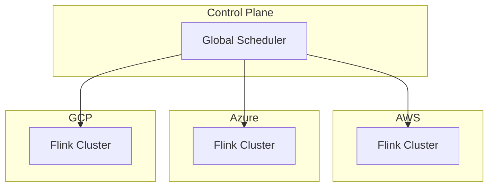

# Flink 3.0 云原生深化 特性跟踪

> 所属阶段: Flink/roadmap | 前置依赖: [K8s Operator][^1] | 形式化等级: L4

## 1. 概念定义 (Definitions)

### Def-F-30-11: Cloud-Native Flink

云原生Flink定义为：

- 容器化部署
- 声明式配置
- 弹性伸缩
- 服务网格集成

### Def-F-30-12: Multi-Cloud Abstraction

多云抽象层：
$$
\text{API}_{\text{cloud}} : \{AWS, Azure, GCP, ...\} \to \text{Unified Interface}
$$

## 2. 属性推导 (Properties)

### Prop-F-30-09: Platform Portability

平台可移植性：
$$
\text{Job}_{\text{cloud}_1} \xrightarrow{\text{迁移}} \text{Job}_{\text{cloud}_2}
$$

## 3. 关系建立 (Relations)

### 云原生特性

| 特性 | 描述 | 状态 |
|------|------|------|
| Service Mesh | Istio集成 | 规划 |
| GitOps | Flux/ArgoCD | 规划 |
| FinOps | 成本优化 | 规划 |
| Multi-cloud | 多云编排 | 规划 |

## 4. 论证过程 (Argumentation)

### 4.1 云原生架构



## 5. 形式证明 / 工程论证

### 5.1 多云部署

```yaml
apiVersion: flink.apache.org/v3
kind: FlinkJob
metadata:
  name: multi-cloud-job
spec:
  deployment:
    strategy: multi-cloud
    regions:
      - aws:us-west-2
      - azure:west-us-2
    failover:
      mode: active-active
```

## 6. 实例验证 (Examples)

### 6.1 Helm配置

```yaml
# values.yaml
cloud:
  provider: aws
  region: us-west-2

serviceMesh:
  enabled: true
  type: istio
```

## 7. 可视化 (Visualizations)



## 8. 引用参考 (References)

[^1]: Flink Kubernetes Operator

---

## 跟踪信息

| 属性 | 值 |
|------|-----|
| 目标版本 | Flink 3.0 |
| 当前状态 | 愿景阶段 |
