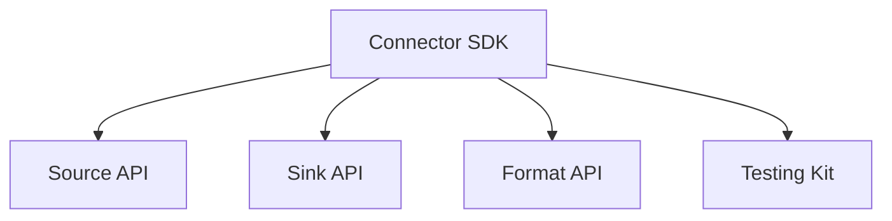
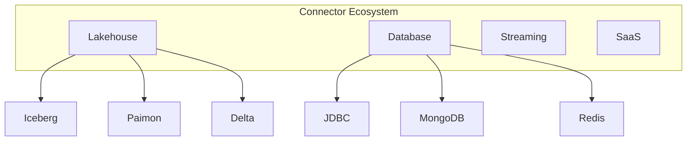

# Flink 3.0 连接器生态 特性跟踪

> 所属阶段: Flink/roadmap | 前置依赖: [Connectors][^1] | 形式化等级: L3

## 1. 概念定义 (Definitions)

### Def-F-30-09: Connector SDK

连接器SDK定义开发标准接口：

```
Connector = SourceConnector ∪ SinkConnector ∪ LookupConnector
```

### Def-F-30-10: Unified Format

统一数据格式：
$$
\text{Format} : \text{Bytes} \leftrightarrow \text{StructuredData}
$$

## 2. 属性推导 (Properties)

### Prop-F-30-08: Connector Isolation

连接器隔离性：
$$
\text{Crash}(C_i) \not\Rightarrow \text{Crash}(\text{System})
$$

## 3. 关系建立 (Relations)

### 3.0连接器目标

| 类别 | 目标数量 | 2.x现状 |
|------|----------|---------|
| Lakehouse | 10+ | 3 |
| Database | 20+ | 10 |
| Streaming | 15+ | 8 |
| SaaS | 30+ | 10 |

## 4. 论证过程 (Argumentation)

### 4.1 Connector SDK架构



## 5. 形式证明 / 工程论证

### 5.1 连接器模板

```java
public class MyConnector implements SourceConnector {
    @Override
    public SourceReader createReader(SourceConfig config) {
        return new MySourceReader(config);
    }

    @Override
    public SplitEnumerator createEnumerator() {
        return new MySplitEnumerator();
    }
}
```

## 6. 实例验证 (Examples)

### 6.1 连接器配置

```yaml
connector:
  type: custom
  class: com.example.MyConnector
  config:
    endpoint: http://api.example.com
    batch-size: 1000
```

## 7. 可视化 (Visualizations)



## 8. 引用参考 (References)

[^1]: Flink Connectors

---

## 跟踪信息

| 属性 | 值 |
|------|-----|
| 目标版本 | Flink 3.0 |
| 当前状态 | 规划阶段 |
