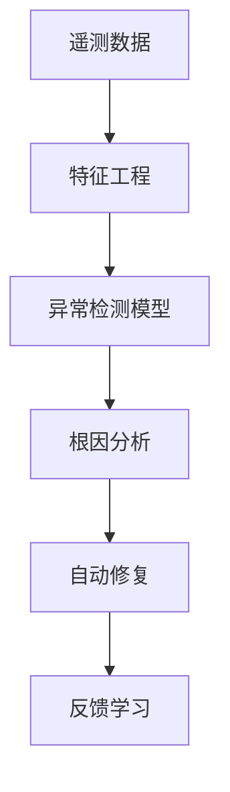
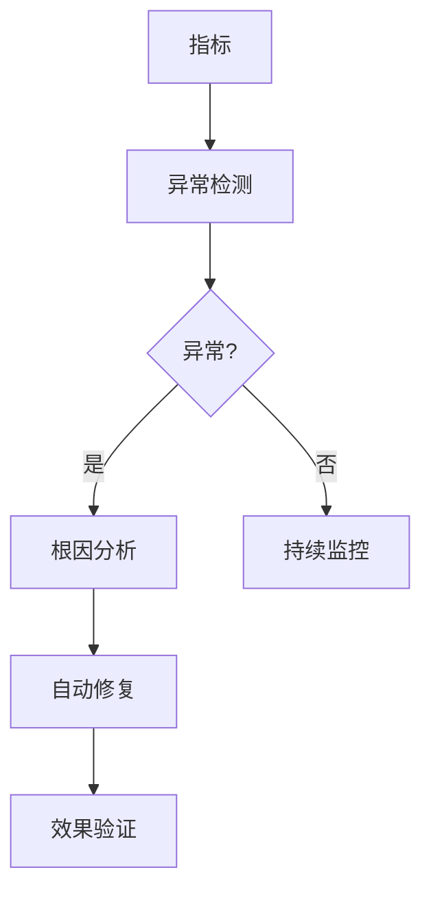

# Flink 3.0 可观测性重塑 特性跟踪

> 所属阶段: Flink/roadmap | 前置依赖: [Observability][^1] | 形式化等级: L4

## 1. 概念定义 (Definitions)

### Def-F-30-15: AI-Powered Observability

AI驱动可观测性：
$$
\text{Insight} = \text{ML}(\text{Metrics}, \text{Logs}, \text{Traces})
$$

### Def-F-30-16: Auto-Remediation

自动修复：
$$
\text{Action} = f(\text{Anomaly}, \text{Policy})
$$

## 2. 属性推导 (Properties)

### Prop-F-30-11: Proactive Detection

主动检测：
$$
P(\text{Detect} | \text{Failure}) \approx 1, \text{ before failure occurs}
$$

## 3. 关系建立 (Relations)

### 可观测性演进

| 版本 | 特点 |
|------|------|
| 2.x | 被动监控 |
| 3.0 | 主动智能 |

## 4. 论证过程 (Argumentation)

### 4.1 AI可观测性架构



## 5. 形式证明 / 工程论证

### 5.1 异常检测模型

```python
class FlinkAnomalyDetector:
    def __init__(self):
        self.model = TransformerModel()

    def predict(self, metrics):
        return self.model.predict(metrics)
```

## 6. 实例验证 (Examples)

### 6.1 配置

```yaml
observability:
  ai.enabled: true
  auto-remediation:
    enabled: true
    policies:
      - condition: high_latency
        action: scale_up
```

## 7. 可视化 (Visualizations)



## 8. 引用参考 (References)

[^1]: Flink Observability

---

## 跟踪信息

| 属性 | 值 |
|------|-----|
| 目标版本 | Flink 3.0 |
| 当前状态 | 愿景阶段 |
