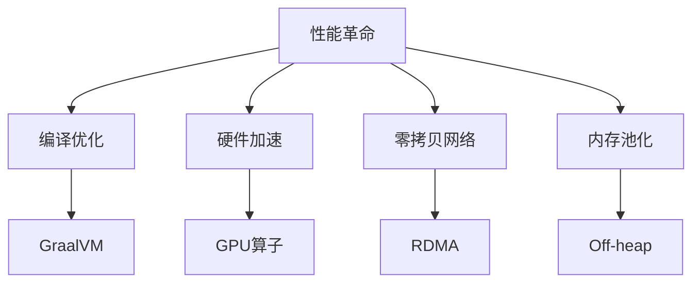

# Flink 3.0 性能革命 特性跟踪

> 所属阶段: Flink/roadmap | 前置依赖: [Performance Tuning][^1] | 形式化等级: L4

## 1. 概念定义 (Definitions)

### Def-F-30-13: Performance Revolution

性能革命定义为数量级提升：
$$
\text{Speedup}_{3.0/2.x} \geq 2
$$

### Def-F-30-14: Hardware Acceleration

硬件加速：
$$
\text{Accel} = \text{GPU} \cup \text{FPGA} \cup \text{SmartNIC}
$$

## 2. 属性推导 (Properties)

### Prop-F-30-10: Linear Scalability

线性扩展性：
$$
T(P) = \frac{T(1)}{P}, \forall P \leq P_{\text{max}}
$$

## 3. 关系建立 (Relations)

### 性能目标

| 指标 | 2.x | 3.0目标 |
|------|-----|---------|
| TPC-DS | 基准 | 3x |
| 流延迟 | 100ms | 1ms |
| 吞吐 | 1M r/s | 10M r/s |
| 资源效率 | 50% | 90% |

## 4. 论证过程 (Argumentation)

### 4.1 性能优化方向



## 5. 形式证明 / 工程论证

### 5.1 GraalVM优化

```
GraalVM AOT编译:
- 启动时间: 减少10x
- 内存占用: 减少50%
- 峰值性能: 提升20%
```

## 6. 实例验证 (Examples)

### 6.1 配置

```yaml
execution:
  runtime: graalvm
  native-image: true

  hardware:
    gpu.enabled: true
    rdma.enabled: true
```

## 7. 可视化 (Visualizations)

```mermaid
bar title 3.0 性能目标 (vs 2.x)
    y-axis 倍数 --> 0 --> 10
    x-axis [TPC-DS, 延迟提升, 吞吐提升, 效率]
    bar [3, 100, 10, 1.8]
```

## 8. 引用参考 (References)

[^1]: Flink Performance Tuning

---

## 跟踪信息

| 属性 | 值 |
|------|-----|
| 目标版本 | Flink 3.0 |
| 当前状态 | 愿景阶段 |
