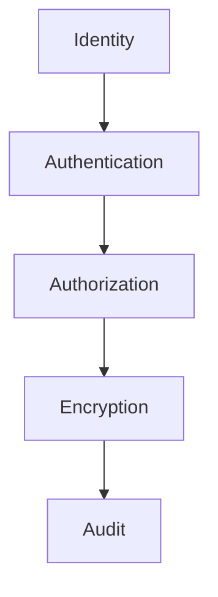
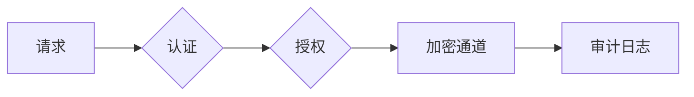

# Flink 3.0 安全架构 特性跟踪

> 所属阶段: Flink/roadmap | 前置依赖: [Security][^1] | 形式化等级: L4

## 1. 概念定义 (Definitions)

### Def-F-30-17: Zero-Trust Security

零信任安全：
$$
\forall x, y : \text{Verify}(x, y), \text{ regardless of network location}
$$

### Def-F-30-18: Confidential Computing

机密计算：
$$
\text{Data} \text{ is encrypted during } \text{Computation}
$$

## 2. 属性推导 (Properties)

### Prop-F-30-12: End-to-End Encryption

端到端加密：
$$
\text{Data}_{\text{plaintext}} \not\in \text{UntrustedZone}
$$

## 3. 关系建立 (Relations)

### 安全特性

| 特性 | 描述 | 状态 |
|------|------|------|
| mTLS强制 | 全链路加密 | 规划 |
| TEE支持 | Intel SGX/AMD SEV | 规划 |
| 同态加密 | 加密计算 | 研究 |
| 零知识证明 | 隐私验证 | 研究 |

## 4. 论证过程 (Argumentation)

### 4.1 零信任架构



## 5. 形式证明 / 工程论证

### 5.1 安全策略

```yaml
security:
  zero-trust:
    enabled: true
    mTLS: required

  confidential-computing:
    enabled: true
    tee: sgx
```

## 6. 实例验证 (Examples)

### 6.1 配置

```yaml
apiVersion: flink.apache.org/v3
kind: FlinkJob
spec:
  security:
    tls:
      mode: strict
    authorization:
      rbac:
        enabled: true
```

## 7. 可视化 (Visualizations)



## 8. 引用参考 (References)

[^1]: Flink Security Documentation

---

## 跟踪信息

| 属性 | 值 |
|------|-----|
| 目标版本 | Flink 3.0 |
| 当前状态 | 愿景阶段 |
