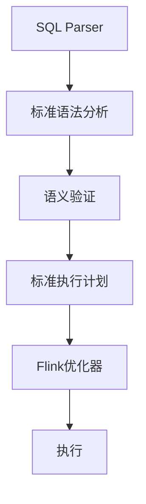
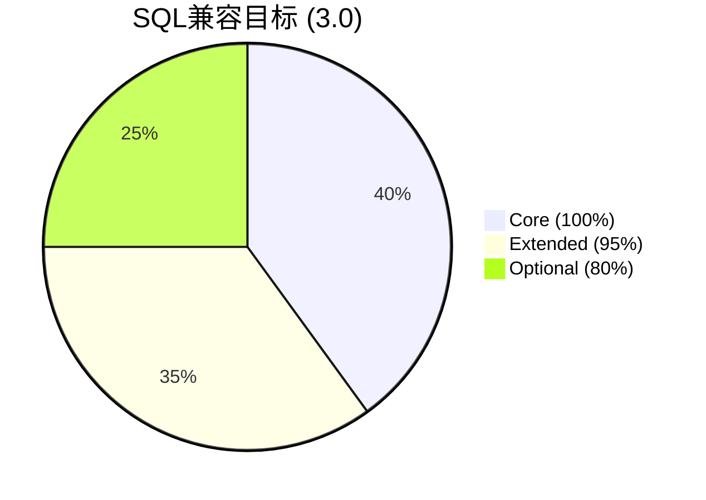

# Flink 3.0 SQL标准完全兼容 特性跟踪

> 所属阶段: Flink/roadmap | 前置依赖: [ANSI SQL 2023][^1] | 形式化等级: L4

## 1. 概念定义 (Definitions)

### Def-F-30-07: Full SQL Compliance
完全SQL兼容定义为：
$$
\text{Compliance} = \frac{|\text{Implemented}|}{|\text{ANSI SQL 2023 Core}|} = 100\%
$$

### Def-F-30-08: Streaming SQL Extension
流式SQL扩展：
$$
\text{StreamingSQL} = \text{ANSI SQL} \cup \{\text{WATERMARK}, \text{EMIT}, \text{WINDOW}...\}
$$

## 2. 属性推导 (Properties)

### Prop-F-30-07: Standard Portability
标准可移植性：
$$
Q_{\text{Flink}} \equiv Q_{\text{Standard}}, \forall Q \in \text{Core SQL}
$$

## 3. 关系建立 (Relations)

### SQL兼容目标

| 标准 | 2.4 | 2.5 | 3.0 |
|------|-----|-----|-----|
| ANSI SQL 2023 Core | 95% | 98% | 100% |
| ANSI SQL 2023 Extended | 70% | 85% | 95% |
| Streaming Extensions | 100% | 100% | 100% |

## 4. 论证过程 (Argumentation)

### 4.1 兼容策略



## 5. 形式证明 / 工程论证

### 5.1 兼容性测试

```java
// TPC-DS测试套件
@RunWith(TPCDSTest.class)
public class SQLComplianceTest {
    @Test
    public void testAllTPCDSQueries() {
        // 验证所有99个TPC-DS查询
    }
}
```

## 6. 实例验证 (Examples)

### 6.1 完整SQL示例

```sql
-- 窗口函数
SELECT 
    department,
    employee,
    salary,
    AVG(salary) OVER (PARTITION BY department) as dept_avg,
    RANK() OVER (PARTITION BY department ORDER BY salary DESC) as rank
FROM employees;

-- 递归CTE
WITH RECURSIVE hierarchy AS (
    SELECT id, name, manager_id, 0 as level
    FROM employees
    WHERE manager_id IS NULL
    UNION ALL
    SELECT e.id, e.name, e.manager_id, h.level + 1
    FROM employees e
    JOIN hierarchy h ON e.manager_id = h.id
)
SELECT * FROM hierarchy;
```

## 7. 可视化 (Visualizations)



## 8. 引用参考 (References)

[^1]: ANSI SQL 2023

---

## 跟踪信息

| 属性 | 值 |
|------|-----|
| 目标版本 | Flink 3.0 |
| 当前状态 | 规划阶段 |
