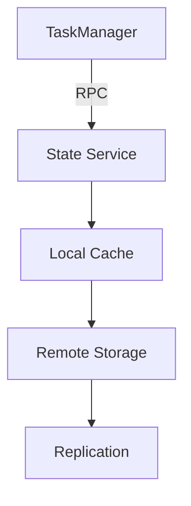
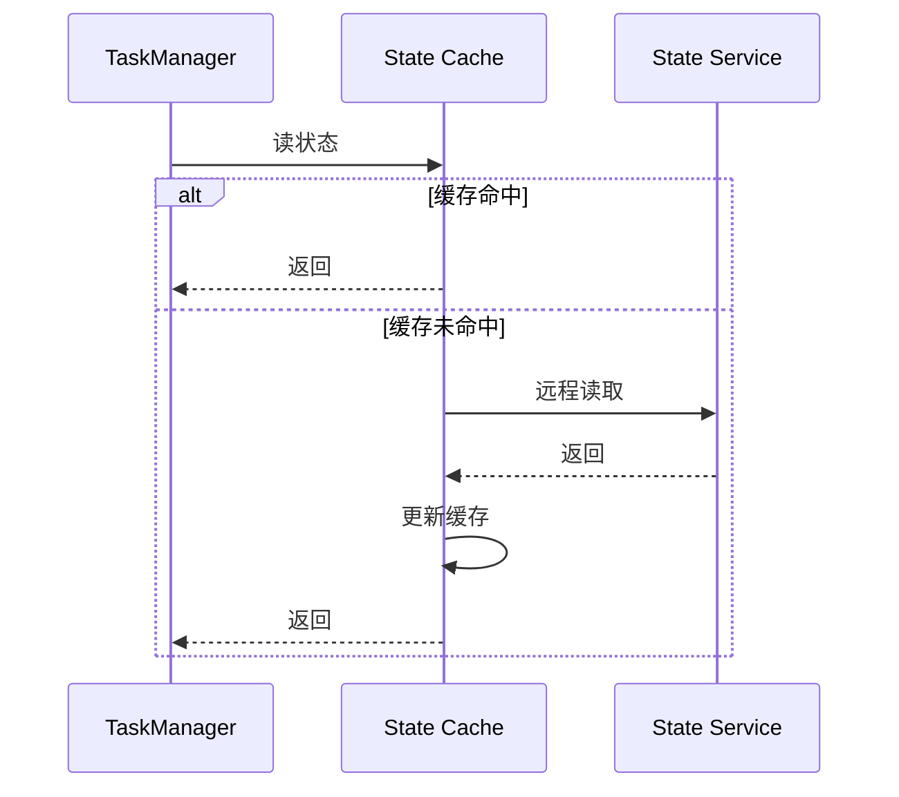

# Flink 3.0 状态管理重构 特性跟踪

> 所属阶段: Flink/roadmap | 前置依赖: [State Backends][^1] | 形式化等级: L5

## 1. 概念定义 (Definitions)

### Def-F-30-05: Disaggregated State
分离式状态定义：
$$
\text{State} \perp \text{Compute} : \text{Scale}(\text{State}) \neq f(\text{Scale}(\text{Compute}))
$$

### Def-F-30-06: State as a Service
状态即服务：
$$
\text{StateService} : (\text{Key}, \text{Operation}) \to \text{Result}
$$

## 2. 属性推导 (Properties)

### Prop-F-30-05: Elastic State
状态弹性：
$$
\text{State}(t) = \text{State}(0) \cdot e^{\lambda t}, \lambda \in \mathbb{R}
$$

### Prop-F-30-06: Fast Recovery
快速恢复：
$$
T_{\text{recovery}} < 1s
$$

## 3. 关系建立 (Relations)

### 状态管理演进

| 版本 | 架构 | 恢复时间 |
|------|------|----------|
| 1.x | 本地 | 分钟级 |
| 2.x | 增量 | 秒级 |
| 3.0 | 分离式 | 亚秒级 |

## 4. 论证过程 (Argumentation)

### 4.1 分离式状态架构



## 5. 形式证明 / 工程论证

### 5.1 状态访问延迟

**定理 (Thm-F-30-03)**: 本地缓存命中率决定平均访问延迟。

$$
E[L] = h \cdot L_{\text{local}} + (1-h) \cdot L_{\text{remote}}
$$

## 6. 实例验证 (Examples)

### 6.1 配置

```yaml
state.backend: disaggregated
state.service:
  endpoint: state-service:8080
  cache:
    size: 1gb
    policy: lru
```

## 7. 可视化 (Visualizations)



## 8. 引用参考 (References)

[^1]: Flink State Management

---

## 跟踪信息

| 属性 | 值 |
|------|-----|
| 目标版本 | Flink 3.0 |
| 当前状态 | 愿景阶段 |
