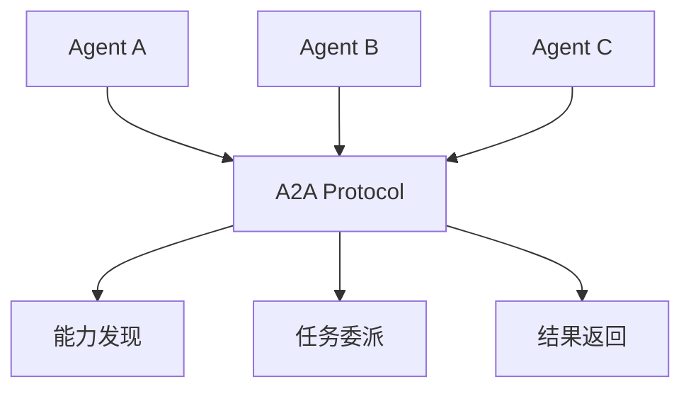
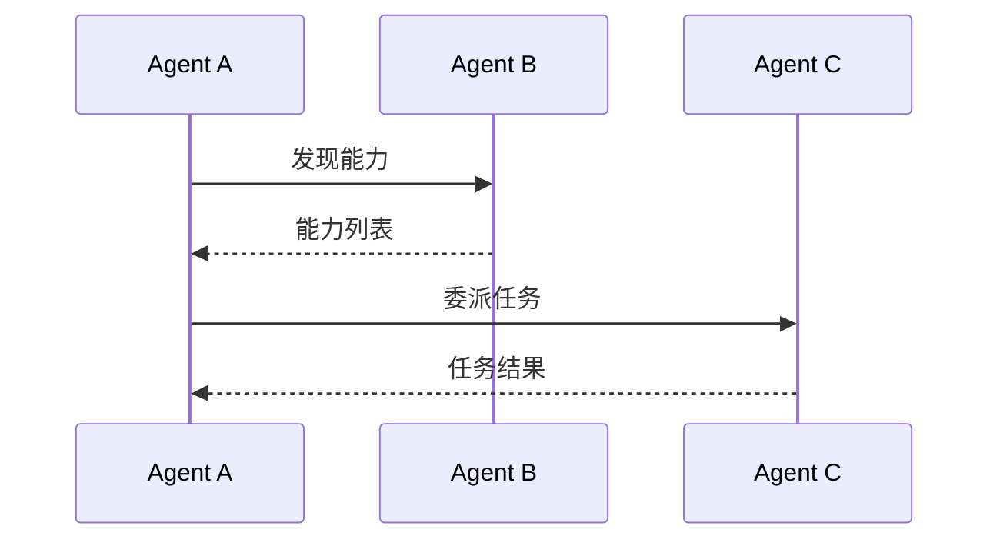

# Flink A2A 协议 演进 特性跟踪

> 所属阶段: Flink/roadmap | 前置依赖: [A2A Protocol][^1] | 形式化等级: L4

## 1. 概念定义 (Definitions)

### Def-F-A2A-01: Agent-to-Agent Protocol
Agent间协议：
$$
\text{A2A} : \text{Agent}_1 \leftrightarrow \text{Agent}_2
$$

### Def-F-A2A-02: Task Delegation
任务委派：
$$
\text{Delegate}(A_1, A_2, \text{Task}) : \text{TaskResult}
$$

## 2. 属性推导 (Properties)

### Prop-F-A2A-01: Capability Negotiation
能力协商：
$$
\text{Negotiate}(A_1, A_2) \to \text{CompatibleInterface}
$$

## 3. 关系建立 (Relations)

### A2A演进

| 版本 | 特性 |
|------|------|
| 2.5 | 基础实现 |
| 3.0 | 完整协议 |

## 4. 论证过程 (Argumentation)

### 4.1 A2A架构



## 5. 形式证明 / 工程论证

### 5.1 A2A消息

```java
public class A2AMessage {
    private String fromAgent;
    private String toAgent;
    private String taskType;
    private Map<String, Object> parameters;
    private String callbackEndpoint;
}
```

## 6. 实例验证 (Examples)

### 6.1 A2A配置

```yaml
a2a:
  agent-id: fraud-detection-agent
  capabilities:
    - type: detect_fraud
      input: Transaction
      output: FraudScore
  endpoints:
    agent-card: /.well-known/agent.json
    tasks: /a2a/tasks
```

## 7. 可视化 (Visualizations)



## 8. 引用参考 (References)

[^1]: Google A2A Protocol

---

## 跟踪信息

| 属性 | 值 |
|------|-----|
| 涵盖版本 | 2.5-3.0 |
| 当前状态 | 设计阶段 |
