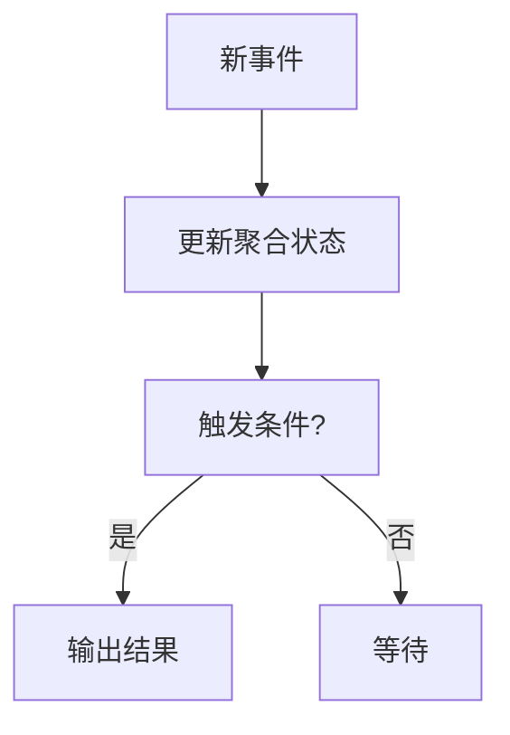
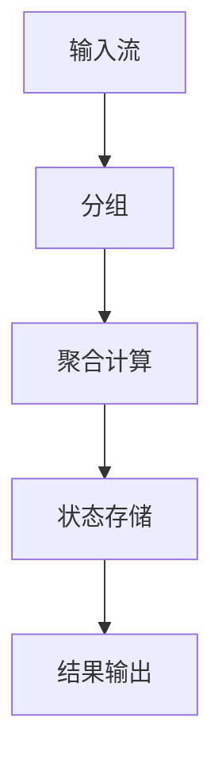

# Flink 聚合函数 演进 特性跟踪

> 所属阶段: Flink/roadmap | 前置依赖: [Aggregations][^1] | 形式化等级: L3

## 1. 概念定义 (Definitions)

### Def-F-AGG-01: Aggregation Types

聚合类型：

- **Scalar Aggregate**: 标量聚合
- **Windowed Aggregate**: 窗口聚合
- **Incremental Aggregate**: 增量聚合
- **Approximate Aggregate**: 近似聚合

### Def-F-AGG-02: Incremental Property

增量属性：
$$
\text{Agg}(S \cup \{e\}) = \text{Update}(\text{Agg}(S), e)
$$

## 2. 属性推导 (Properties)

### Prop-F-AGG-01: Associativity

结合律：
$$
\text{Agg}(A \cup B) = \text{Combine}(\text{Agg}(A), \text{Agg}(B))
$$

## 3. 关系建立 (Relations)

### 聚合演进

| 版本 | 特性 |
|------|------|
| 1.x | 基础聚合 |
| 2.0 | 窗口聚合 |
| 2.4 | 增量聚合优化 |
| 3.0 | 智能聚合 |

## 4. 论证过程 (Argumentation)

### 4.1 增量聚合优化



## 5. 形式证明 / 工程论证

### 5.1 近似聚合

```sql
-- Approximate Count Distinct
SELECT APPROX_COUNT_DISTINCT(user_id)
FROM events;

-- Approximate Quantile
SELECT APPROX_QUANTILE(response_time, 0.99)
FROM requests;
```

## 6. 实例验证 (Examples)

### 6.1 自定义聚合

```java
public class WeightedAvg extends AggregateFunction<Double, WeightedAvgAccum> {
    @Override
    public WeightedAvgAccum createAccumulator() {
        return new WeightedAvgAccum();
    }

    public void accumulate(WeightedAvgAccum acc, Double value, Integer weight) {
        acc.sum += value * weight;
        acc.count += weight;
    }

    @Override
    public Double getResult(WeightedAvgAccum acc) {
        return acc.sum / acc.count;
    }
}
```

## 7. 可视化 (Visualizations)



## 8. 引用参考 (References)

[^1]: Flink Aggregations

---

## 跟踪信息

| 属性 | 值 |
|------|-----|
| 涵盖版本 | 1.x-3.0 |
| 当前状态 | 持续优化 |
