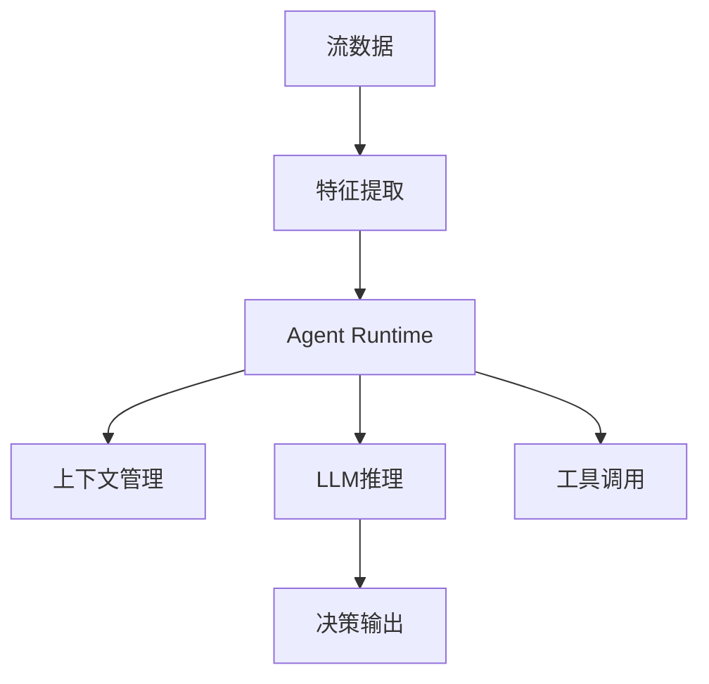
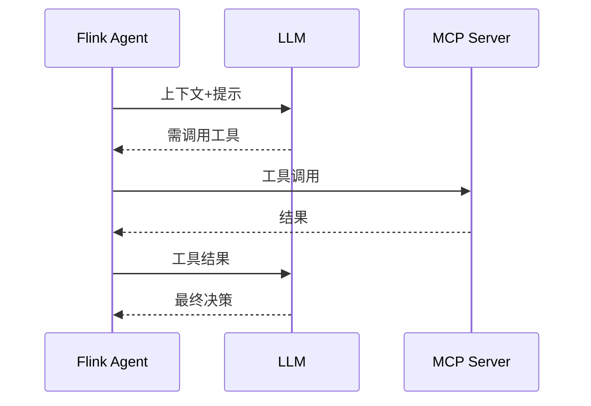

# Flink 2.4 AI Agent 实现 特性跟踪

> 所属阶段: Flink/roadmap | 前置依赖: [FLIP-531][^1] | 形式化等级: L4

## 1. 概念定义 (Definitions)

### Def-F-AI24-01: AI Agent in Streaming
流式AI Agent定义：
$$
\text{Agent} : \text{Observation} \times \text{State} \xrightarrow{\text{LLM}} \text{Action}
$$

### Def-F-AI24-02: Agent Context
Agent上下文：
$$
\text{Context}_t = \{(o_i, a_i)\}_{i=1}^{t-1} \cup \text{KnowledgeBase}
$$

## 2. 属性推导 (Properties)

### Prop-F-AI24-01: Context Persistence
上下文持久化：
$$
\text{Context} \in \text{StateBackend}
$$

### Prop-F-AI24-02: Tool Call Idempotency
工具调用幂等性：
$$
\text{Tool}(x) = \text{Tool}(\text{Tool}(x))
$$

## 3. 关系建立 (Relations)

### 2.4 AI Agent特性

| 特性 | 描述 | 状态 |
|------|------|------|
| LLM集成 | OpenAI/Azure | GA |
| MCP协议 | 工具调用 | Beta |
| 状态管理 | 对话状态 | GA |
| 流式推理 | 增量输出 | Beta |

## 4. 论证过程 (Argumentation)

### 4.1 Agent架构



## 5. 形式证明 / 工程论证

### 5.1 Agent实现

```java
public class AIAgentFunction extends ProcessFunction<Event, Action> {
    private ValueState<AgentContext> contextState;
    private transient LLMClient llm;
    
    @Override
    public void processElement(Event event, Context ctx, Collector<Action> out) {
        AgentContext context = contextState.value();
        context.addObservation(event);
        
        LLMResponse response = llm.infer(context);
        if (response.requiresAction()) {
            out.collect(response.getAction());
        }
        
        contextState.update(context);
    }
}
```

## 6. 实例验证 (Examples)

### 6.1 Agent配置

```yaml
ai.agent:
  llm.provider: openai
  llm.model: gpt-4
  mcp.enabled: true
  mcp.servers:
    - name: database
      url: http://db-mcp:8080
```

## 7. 可视化 (Visualizations)



## 8. 引用参考 (References)

[^1]: FLIP-531 AI Agents

---

## 跟踪信息

| 属性 | 值 |
|------|-----|
| 目标版本 | Flink 2.4 |
| 当前状态 | 开发中 |
