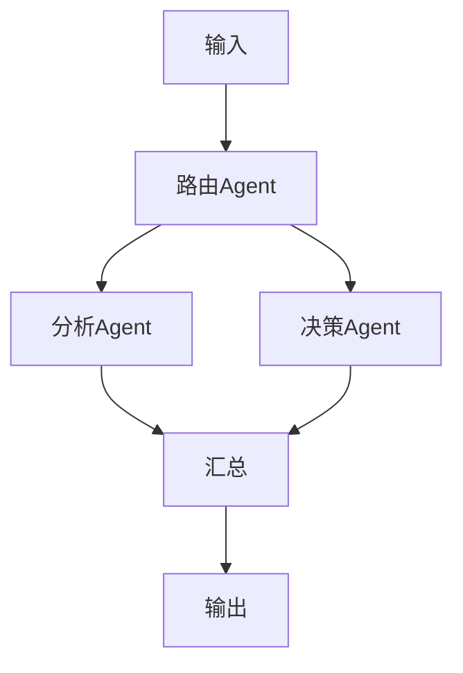
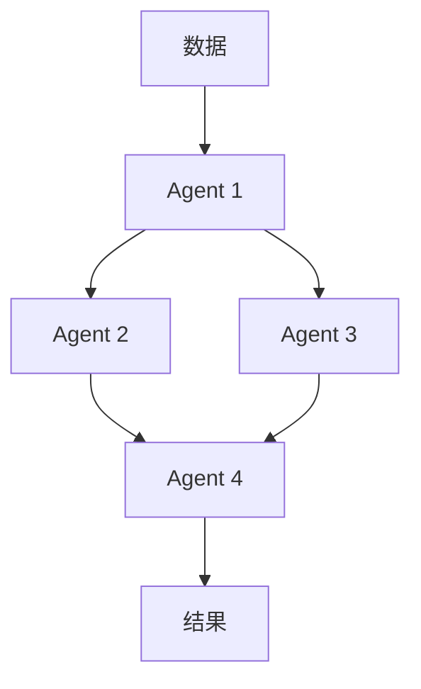

# Flink 2.5 AI Agent 成熟 特性跟踪

> 所属阶段: Flink/roadmap | 前置依赖: [2.4 AI Agent][^1] | 形式化等级: L4

## 1. 概念定义 (Definitions)

### Def-F-AI25-01: Multi-Agent Coordination
多智能体协调：
$$
\text{Coordination} : \{\text{Agent}_i\}_{i=1}^n \to \text{CollectiveAction}
$$

### Def-F-AI25-02: Agent Orchestration
Agent编排：
$$
\text{Workflow} = \text{DAG}(\text{AgentNodes})
$$

## 2. 属性推导 (Properties)

### Prop-F-AI25-01: Consensus
一致性：
$$
\forall a_i, a_j \in \text{Agents} : \text{Decision}_i \sim \text{Decision}_j
$$

## 3. 关系建立 (Relations)

### 2.5 AI Agent特性

| 特性 | 描述 | 状态 |
|------|------|------|
| 多Agent | 协作系统 | Beta |
| A2A协议 | Google协议 | Beta |
| 工作流 | 编排引擎 | GA |
| 评估 | Agent评估 | Beta |

## 4. 论证过程 (Argumentation)

### 4.1 多Agent架构



## 5. 形式证明 / 工程论证

### 5.1 A2A协议集成

```java
// A2A协议消息
public class A2AMessage {
    private String agentId;
    private String taskId;
    private Map<String, Object> parameters;
    private String callbackUrl;
}
```

## 6. 实例验证 (Examples)

### 6.1 工作流定义

```yaml
agent.workflow:
  name: fraud-detection
  steps:
    - name: data-enrichment
      agent: enrichment-agent
    - name: risk-analysis
      agent: risk-agent
      depends: [data-enrichment]
    - name: decision
      agent: decision-agent
      depends: [risk-analysis]
```

## 7. 可视化 (Visualizations)



## 8. 引用参考 (References)

[^1]: Flink 2.4 AI Agent

---

## 跟踪信息

| 属性 | 值 |
|------|-----|
| 目标版本 | Flink 2.5 |
| 当前状态 | 设计阶段 |
