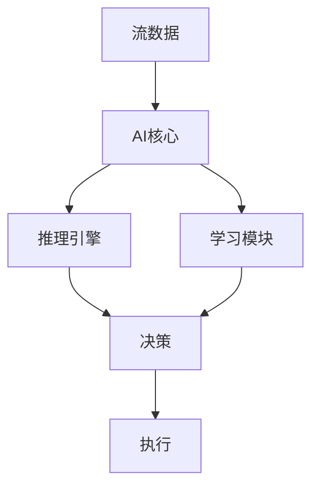
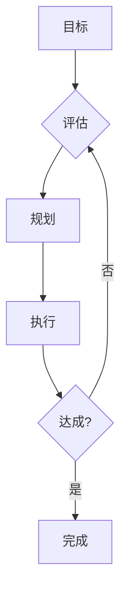

# Flink 3.0 AI Agent 原生 特性跟踪

> 所属阶段: Flink/roadmap | 前置依赖: [2.5 AI Agent][^1] | 形式化等级: L5

## 1. 概念定义 (Definitions)

### Def-F-AI30-01: AI-Native Streaming
AI原生流处理：
$$
\text{Streaming}_{\text{AI}} = \text{Core} \times \text{AI}
$$

### Def-F-AI30-02: Autonomous Agent
自主Agent：
$$
\text{Autonomous} : \text{Goal} \xrightarrow{\text{SelfDirected}} \text{Achievement}
$$

## 2. 属性推导 (Properties)

### Prop-F-AI30-01: Self-Optimization
自优化：
$$
\text{Performance}_{t+1} > \text{Performance}_t
$$

## 3. 关系建立 (Relations)

### 3.0 AI愿景

| 特性 | 描述 | 状态 |
|------|------|------|
| 内置LLM | 本地模型 | 研究 |
| 自治运维 | 自修复 | 愿景 |
| 智能优化 | AI驱动 | 规划 |
| 认知架构 | 类脑系统 | 研究 |

## 4. 论证过程 (Argumentation)

### 4.1 AI原生架构



## 5. 形式证明 / 工程论证

### 5.1 原生AI SQL

```sql
-- AI原生SQL
SELECT 
    user_id,
    AI_ANALYZE(behavior) as intent,
    AI_PREDICT(churn) as risk_score
FROM user_events;
```

## 6. 实例验证 (Examples)

### 6.1 自治Agent

```java
// 自治Agent示例
AutonomousAgent agent = AutonomousAgent.builder()
    .goal("optimize-throughput")
    .actions(Set.of(SCALE, CONFIGURE, REROUTE))
    .constraints(ResourceConstraints.standard())
    .build();
```

## 7. 可视化 (Visualizations)



## 8. 引用参考 (References)

[^1]: Flink 2.5 AI Agent

---

## 跟踪信息

| 属性 | 值 |
|------|-----|
| 目标版本 | Flink 3.0 |
| 当前状态 | 愿景阶段 |
