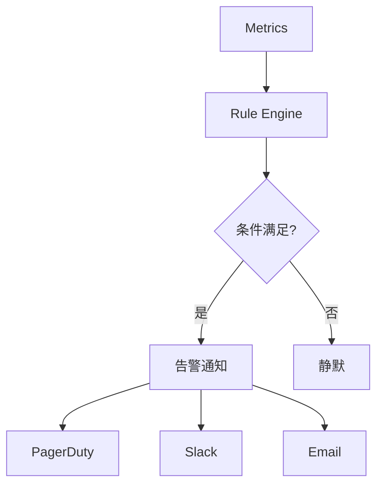
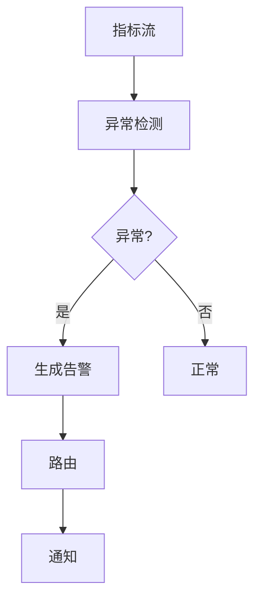

# Flink 告警系统 演进 特性跟踪

> 所属阶段: Flink/roadmap | 前置依赖: [Alerting][^1] | 形式化等级: L3

## 1. 概念定义 (Definitions)

### Def-F-ALERT-01: Alert Rule
告警规则：
$$
\text{Rule} : \text{Condition} \to \text{Notification}
$$

### Def-F-ALERT-02: Alert Severity
告警严重级别：
$$
\text{Severity} \in \{\text{INFO}, \text{WARNING}, \text{CRITICAL}, \text{EMERGENCY}\}
$$

## 2. 属性推导 (Properties)

### Prop-F-ALERT-01: Alert Fatigue Prevention
告警疲劳预防：
$$
\text{Rate}(\text{Alert}) \leq T_{\text{acceptable}}
$$

## 3. 关系建立 (Relations)

### 告警演进

| 版本 | 特性 |
|------|------|
| 2.0 | 外部集成 |
| 2.4 | 内置告警 |
| 3.0 | 智能告警 |

## 4. 论证过程 (Argumentation)

### 4.1 告警架构



## 5. 形式证明 / 工程论证

### 5.1 告警规则

```yaml
alerting:
  rules:
    - name: high_latency
      condition: latency_p99 > 1000
      severity: warning
      channels: [slack, email]
      throttle: 5m
    
    - name: job_failure
      condition: job_status == FAILED
      severity: critical
      channels: [pagerduty]
```

## 6. 实例验证 (Examples)

### 6.1 动态阈值

```java
// ML驱动的动态阈值
public class AdaptiveAlert {
    public boolean check(Metrics metrics) {
        double baseline = mlModel.predict(metrics);
        double threshold = baseline * 1.5;
        return metrics.getValue() > threshold;
    }
}
```

## 7. 可视化 (Visualizations)



## 8. 引用参考 (References)

[^1]: Prometheus Alertmanager

---

## 跟踪信息

| 属性 | 值 |
|------|-----|
| 涵盖版本 | 2.0-3.0 |
| 当前状态 | 智能告警 |
