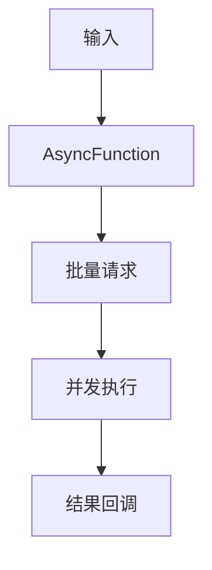
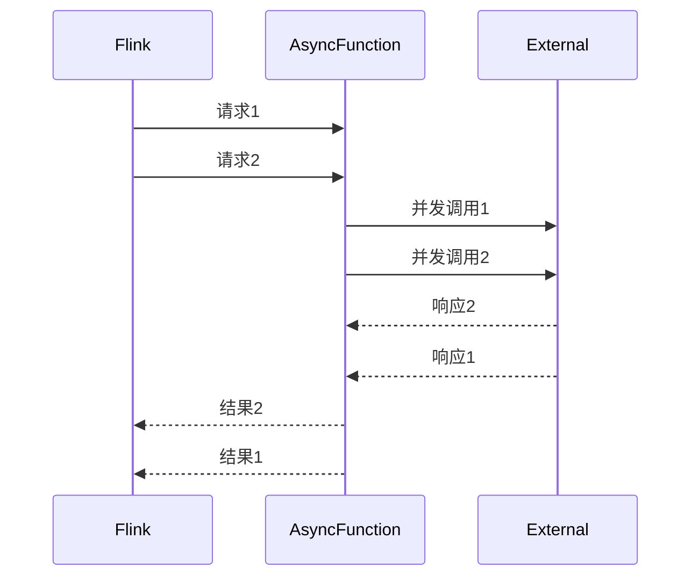

# Flink 异步API 演进 特性跟踪

> 所属阶段: Flink/roadmap | 前置依赖: [Async I/O][^1] | 形式化等级: L4

## 1. 概念定义 (Definitions)

### Def-F-ASYNC-01: Async I/O
异步I/O：
$$
\text{AsyncOp} : \text{Input} \xrightarrow{\text{async}} \text{Future}<\text{Output}>
$$

### Def-F-ASYNC-02: Capacity
并发容量：
$$
\text{Capacity} = \max \{\text{ConcurrentRequests}\}
$$

## 2. 属性推导 (Properties)

### Prop-F-ASYNC-01: Ordering Guarantee
顺序保证：
$$
\text{Ordered} \lor \text{Unordered}
$$

## 3. 关系建立 (Relations)

### 异步API演进

| 版本 | 特性 |
|------|------|
| 1.x | 基础Async |
| 2.0 | 批量优化 |
| 2.4 | 智能批处理 |
| 3.0 | 自适应并发 |

## 4. 论证过程 (Argumentation)

### 4.1 异步架构



## 5. 形式证明 / 工程论证

### 5.1 Async I/O实现

```java
public class AsyncDatabaseRequest extends RichAsyncFunction<String, String> {
    private transient DatabaseClient client;
    
    @Override
    public void open(Configuration parameters) {
        client = new DatabaseClient(...);
    }
    
    @Override
    public void asyncInvoke(String key, ResultFuture<String> resultFuture) {
        client.asyncQuery(key, resultFuture::complete);
    }
}
```

## 6. 实例验证 (Examples)

### 6.1 无序输出

```java
DataStream<String> result = AsyncDataStream
    .unorderedWait(
        inputStream,
        new AsyncDatabaseRequest(),
        1000, TimeUnit.MILLISECONDS,
        100  // capacity
    );
```

## 7. 可视化 (Visualizations)



## 8. 引用参考 (References)

[^1]: Flink Async I/O

---

## 跟踪信息

| 属性 | 值 |
|------|-----|
| 涵盖版本 | 1.x-3.0 |
| 当前状态 | 智能批处理 |
