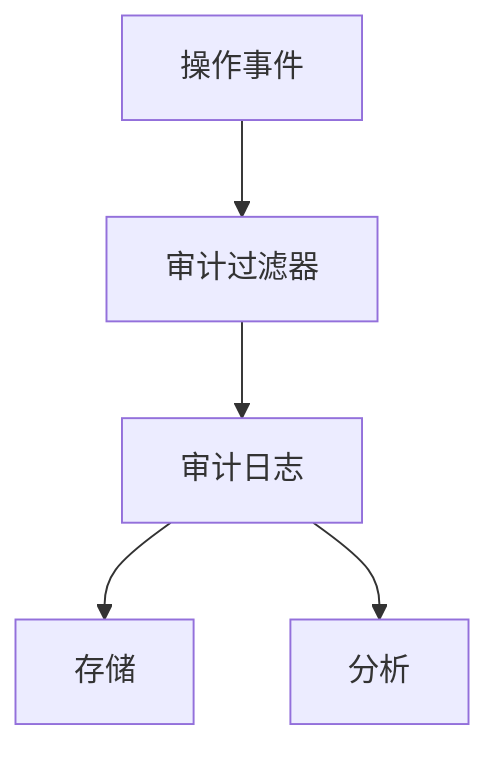
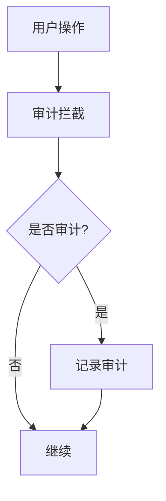

# Flink 审计机制 演进 特性跟踪

> 所属阶段: Flink/roadmap | 前置依赖: [Auditing][^1] | 形式化等级: L3

## 1. 概念定义 (Definitions)

### Def-F-AUDIT-01: Audit Log
审计日志：
$$
\text{Audit} = (\text{Who}, \text{What}, \text{When}, \text{Where}, \text{Result})
$$

### Def-F-AUDIT-02: Audit Policy
审计策略：
$$
\text{Policy} : \text{EventType} \to \{\text{Log}, \text{Ignore}\}
$$

## 2. 属性推导 (Properties)

### Prop-F-AUDIT-01: Tamper Evidence
防篡改：
$$
\text{Tamper}(\text{Log}) \Rightarrow \text{Detectable}
$$

## 3. 关系建立 (Relations)

### 审计演进

| 版本 | 特性 |
|------|------|
| 2.0 | 基础日志 |
| 2.4 | 结构化审计 |
| 3.0 | 区块链验证 |

## 4. 论证过程 (Argumentation)

### 4.1 审计架构



## 5. 形式证明 / 工程论证

### 5.1 审计配置

```yaml
security.audit:
  enabled: true
  events:
    - job.submit
    - job.cancel
    - config.change
    - auth.failure
  output: /var/log/flink/audit.log
  format: json
```

## 6. 实例验证 (Examples)

### 6.1 审计日志示例

```json
{
  "timestamp": "2025-01-01T00:00:00Z",
  "user": "alice",
  "action": "job.submit",
  "resource": "job-123",
  "result": "success",
  "client_ip": "192.168.1.1"
}
```

## 7. 可视化 (Visualizations)



## 8. 引用参考 (References)

[^1]: Flink Security Audit

---

## 跟踪信息

| 属性 | 值 |
|------|-----|
| 涵盖版本 | 2.0-3.0 |
| 当前状态 | 结构化审计 |
