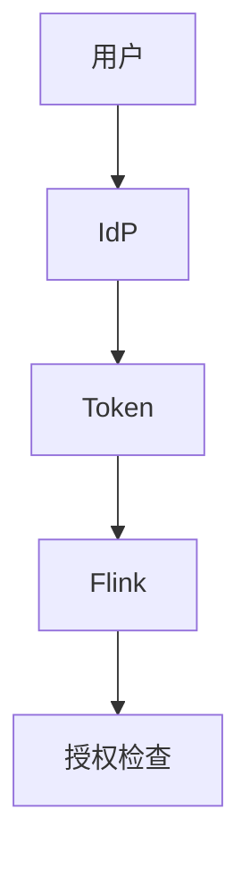
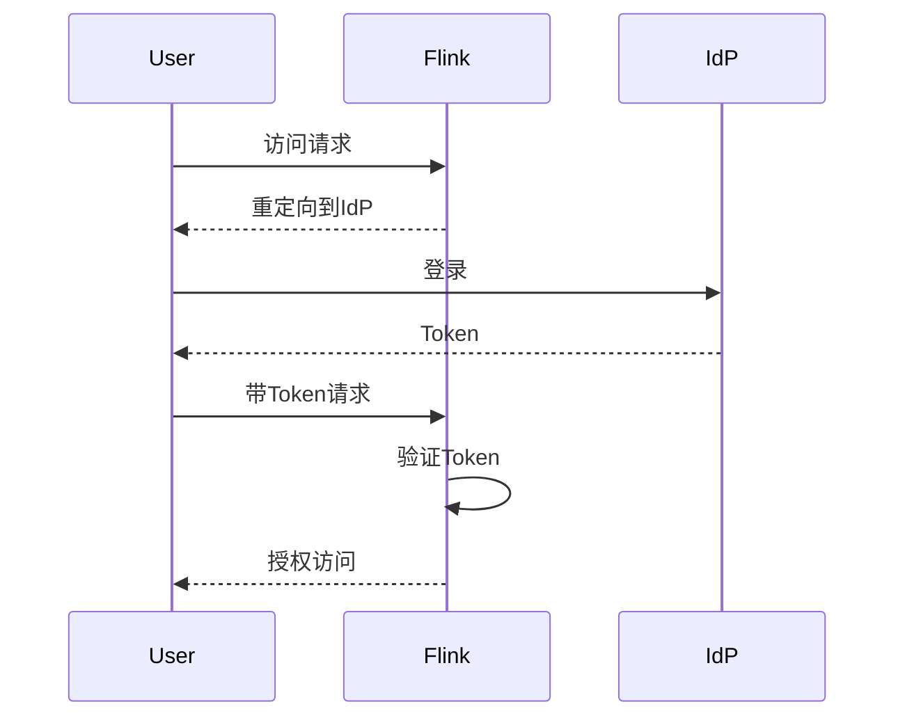

# Flink 认证机制 演进 特性跟踪

> 所属阶段: Flink/roadmap | 前置依赖: [Authentication][^1] | 形式化等级: L4

## 1. 概念定义 (Definitions)

### Def-F-AUTH-01: Authentication
认证：
$$
\text{AuthN} : \text{Credentials} \to \{\text{Success}, \text{Failure}\}
$$

### Def-F-AUTH-02: Identity Provider
身份提供商：
$$
\text{IdP} \in \{\text{LDAP}, \text{Kerberos}, \text{OAuth2}, \text{OIDC}\}
$$

## 2. 属性推导 (Properties)

### Prop-F-AUTH-01: Session Security
会话安全：
$$
\text{Token} \Rightarrow \text{Expiry} \land \text{Refresh}
$$

## 3. 关系建立 (Relations)

### 认证演进

| 版本 | 机制 |
|------|------|
| 1.x | 基础Kerberos |
| 2.0 | OAuth2支持 |
| 2.4 | OIDC集成 |
| 3.0 | mTLS强制 |

## 4. 论证过程 (Argumentation)

### 4.1 认证架构



## 5. 形式证明 / 工程论证

### 5.1 OIDC配置

```yaml
security:
  authentication:
    type: oidc
    oidc:
      issuer: https://auth.example.com
      client-id: flink-client
      client-secret: ${CLIENT_SECRET}
      scopes: [openid, profile]
```

## 6. 实例验证 (Examples)

### 6.1 Kerberos配置

```yaml
security.kerberos:
  login.keytab: /etc/flink/flink.keytab
  login.principal: flink@EXAMPLE.COM
  krb5.conf.path: /etc/krb5.conf
```

## 7. 可视化 (Visualizations)



## 8. 引用参考 (References)

[^1]: Flink Security Documentation

---

## 跟踪信息

| 属性 | 值 |
|------|-----|
| 涵盖版本 | 1.x-3.0 |
| 当前状态 | OIDC集成 |
