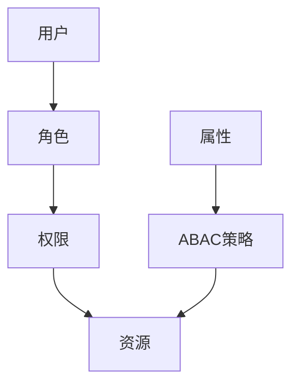
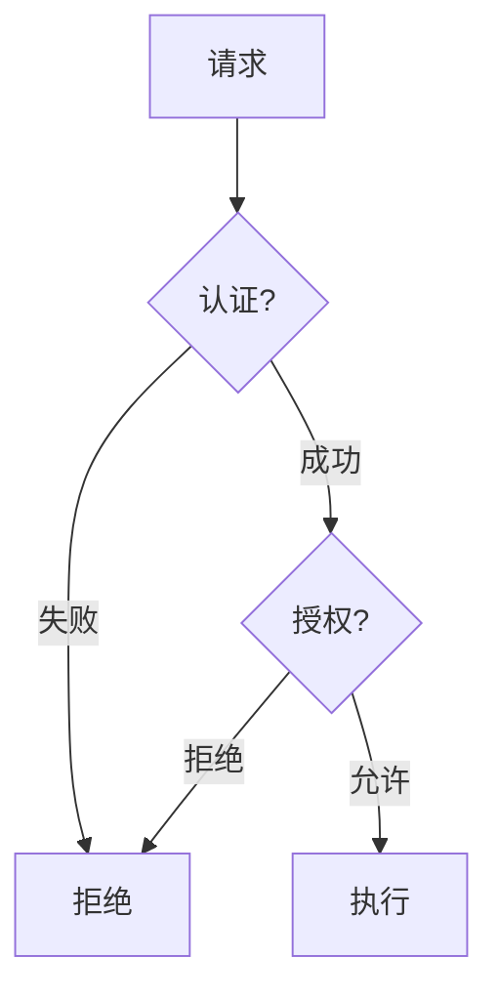

# Flink 授权机制 演进 特性跟踪

> 所属阶段: Flink/roadmap | 前置依赖: [Authorization][^1] | 形式化等级: L4

## 1. 概念定义 (Definitions)

### Def-F-AUTHZ-01: Authorization
授权：
$$
\text{AuthZ} : (\text{Subject}, \text{Resource}, \text{Action}) \to \{\text{Allow}, \text{Deny}\}
$$

### Def-F-AUTHZ-02: RBAC
基于角色的访问控制：
$$
\text{RBAC} = (\text{Users}, \text{Roles}, \text{Permissions}, \text{Assignments})
$$

## 2. 属性推导 (Properties)

### Prop-F-AUTHZ-01: Least Privilege
最小权限：
$$
\text{Permissions}(u) = \min \{p | \text{Job}(u) \text{ can execute}\}
$$

## 3. 关系建立 (Relations)

### 授权演进

| 版本 | 模型 |
|------|------|
| 1.x | 基础ACL |
| 2.0 | RBAC |
| 2.4 | ABAC |
| 3.0 | 动态授权 |

## 4. 论证过程 (Argumentation)

### 4.1 授权架构



## 5. 形式证明 / 工程论证

### 5.1 RBAC配置

```yaml
security:
  authorization:
    type: rbac
    policies:
      - role: admin
        permissions: ['*']
      - role: operator
        permissions: ['job:submit', 'job:cancel']
      - role: viewer
        permissions: ['job:view']
```

## 6. 实例验证 (Examples)

### 6.1 命名空间隔离

```yaml
security:
  namespaces:
    - name: team-a
      allowed-users: [alice, bob]
      resource-quota:
        parallelism: 100
    - name: team-b
      allowed-users: [carol]
      resource-quota:
        parallelism: 50
```

## 7. 可视化 (Visualizations)



## 8. 引用参考 (References)

[^1]: Flink Authorization

---

## 跟踪信息

| 属性 | 值 |
|------|-----|
| 涵盖版本 | 1.x-3.0 |
| 当前状态 | ABAC增强 |
