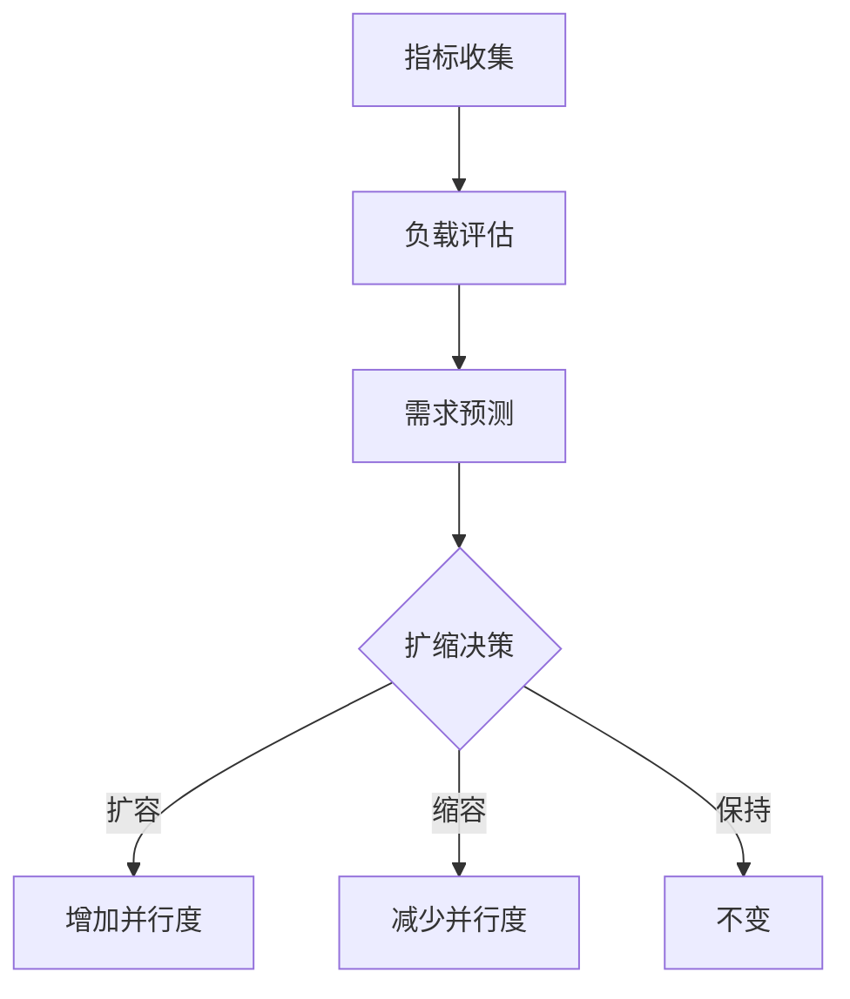
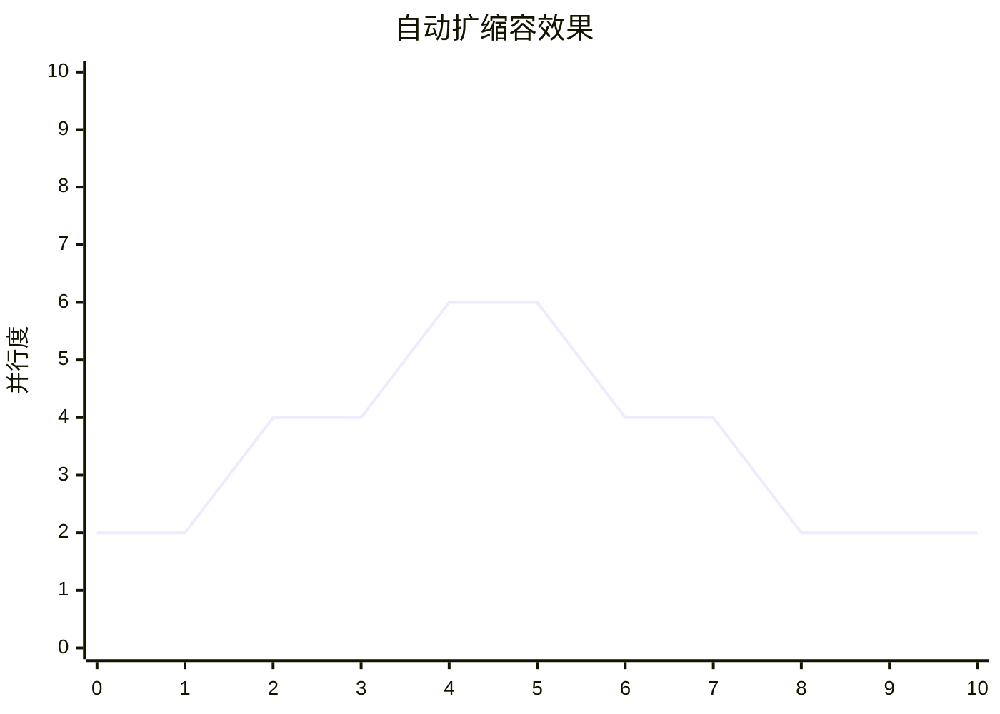

# Flink 自动扩缩容 演进 特性跟踪

> 所属阶段: Flink/roadmap | 前置依赖: [Auto Scaling][^1] | 形式化等级: L4

## 1. 概念定义 (Definitions)

### Def-F-AUTO-01: Autoscaling
自动扩缩容：
$$
\text{Parallelism}(t) = f(\text{Metrics}(t), \text{SLA})
$$

### Def-F-AUTO-02: Scaling Policy
扩缩容策略：
$$
\text{Policy} : (\text{Current}, \text{Target}) \to \text{Action}
$$

## 2. 属性推导 (Properties)

### Prop-F-AUTO-01: Scaling Stability
扩缩稳定性：
$$
|\text{Parallelism}_{t+1} - \text{Parallelism}_t| \leq \Delta_{\text{max}}
$$

### Prop-F-AUTO-02: Cost Efficiency
成本效率：
$$
\min \text{Cost} \quad \text{s.t.} \quad \text{Latency} \leq \text{SLA}
$$

## 3. 关系建立 (Relations)

### Autoscaling演进

| 版本 | 算法 |
|------|------|
| 2.0 | 启发式 |
| 2.4 | 自适应 |
| 2.5 | 预测式 |
| 3.0 | AI驱动 |

## 4. 论证过程 (Argumentation)

### 4.1 扩缩容算法



## 5. 形式证明 / 工程论证

### 5.1 PID控制器

$$
P(t) = K_p \cdot e(t) + K_i \cdot \int e(t)dt + K_d \cdot \frac{de}{dt}
$$

其中 $e(t) = \text{Target} - \text{Current}$。

## 6. 实例验证 (Examples)

### 6.1 配置

```yaml
autoscaling:
  enabled: true
  min-parallelism: 2
  max-parallelism: 100
  target-utilization: 0.7
  scale-up-delay: 30s
  scale-down-delay: 60s
```

## 7. 可视化 (Visualizations)



## 8. 引用参考 (References)

[^1]: Flink Autoscaling

---

## 跟踪信息

| 属性 | 值 |
|------|-----|
| 涵盖版本 | 2.0-3.0 |
| 当前状态 | 预测式扩缩容 |
