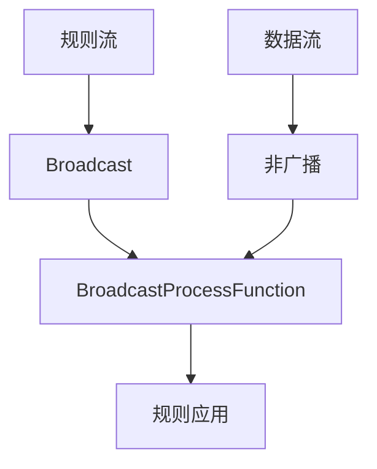
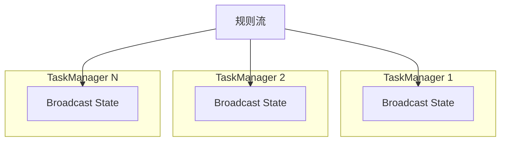

# Flink 广播状态API 演进 特性跟踪

> 所属阶段: Flink/roadmap | 前置依赖: [Broadcast State][^1] | 形式化等级: L4

## 1. 概念定义 (Definitions)

### Def-F-BROADCAST-01: Broadcast Stream
广播流：
$$
\text{Broadcast} : \text{Data} \to \text{AllParallelInstances}
$$

### Def-F-BROADCAST-02: Broadcast State
广播状态：
$$
\text{BroadcastState} : \text{Key} \to \text{Value}, \text{ replicated}
$$

## 2. 属性推导 (Properties)

### Prop-F-BROADCAST-01: Consistency
一致性：
$$
\forall i, j : \text{BroadcastState}_i \equiv \text{BroadcastState}_j
$$

## 3. 关系建立 (Relations)

### 广播状态演进

| 版本 | 特性 |
|------|------|
| 1.x | 无原生支持 |
| 2.0 | Broadcast State引入 |
| 2.4 | 增量更新 |
| 3.0 | 动态规则 |

## 4. 论证过程 (Argumentation)

### 4.1 广播架构



## 5. 形式证明 / 工程论证

### 5.1 BroadcastProcessFunction

```java
public class DynamicFilter extends BroadcastProcessFunction<Event, Rule, FilteredEvent> {
    @Override
    public void processElement(Event value, ReadOnlyContext ctx, 
                               Collector<FilteredEvent> out) {
        Rule rule = ctx.getBroadcastState(ruleDescriptor).get(value.getType());
        if (rule != null && rule.matches(value)) {
            out.collect(new FilteredEvent(value, rule));
        }
    }
    
    @Override
    public void processBroadcastElement(Rule value, Context ctx, 
                                        Collector<FilteredEvent> out) {
        ctx.getBroadcastState(ruleDescriptor).put(value.getType(), value);
    }
}
```

## 6. 实例验证 (Examples)

### 6.1 动态配置更新

```java
// 广播流连接数据流
DataStream<FilteredEvent> result = dataStream
    .connect(ruleStream.broadcast(rulesStateDescriptor))
    .process(new DynamicFilter());
```

## 7. 可视化 (Visualizations)



## 8. 引用参考 (References)

[^1]: Flink Broadcast State

---

## 跟踪信息

| 属性 | 值 |
|------|-----|
| 涵盖版本 | 2.0-3.0 |
| 当前状态 | 动态规则支持 |
