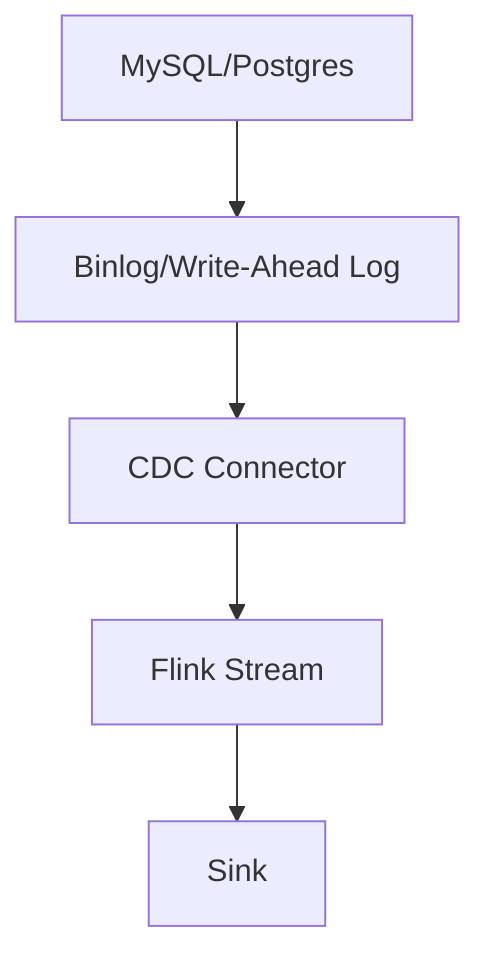
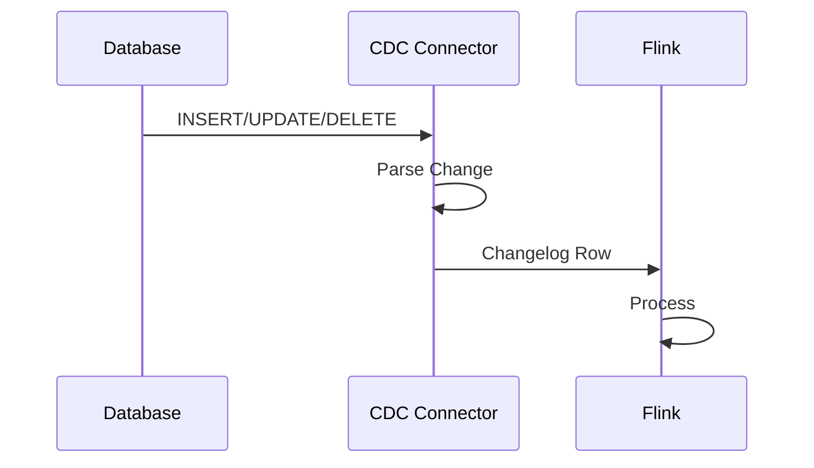

# Flink CDC 连接器 演进 特性跟踪

> 所属阶段: Flink/roadmap | 前置依赖: [CDC Connectors][^1] | 形式化等级: L4

## 1. 概念定义 (Definitions)

### Def-F-CDC-01: Change Data Capture
变更数据捕获：
$$
\text{CDC} : \text{DBChanges} \to \text{ChangeStream}
$$

### Def-F-CDC-02: Changelog Format
变更日志格式：
$$
\text{Changelog} = (\text{Op}, \text{Before}, \text{After})
$$
其中 $\text{Op} \in \{I, U, D\}$

## 2. 属性推导 (Properties)

### Prop-F-CDC-01: Exactly-Once Capture
精确一次捕获：
$$
\text{AllChangesCaptured} \land \text{NoDuplicates}
$$

## 3. 关系建立 (Relations)

### CDC连接器演进

| 版本 | 特性 |
|------|------|
| 2.0 | Debezium集成 |
| 2.4 | CDC 3.0 |
| 3.0 | 原生CDC |

## 4. 论证过程 (Argumentation)

### 4.1 CDC架构



## 5. 形式证明 / 工程论证

### 5.1 Schema Evolution

```sql
-- CDC表自动同步Schema变更
CREATE TABLE mysql_products (
    id INT,
    name STRING,
    price DECIMAL(10,2)
) WITH (
    'connector' = 'mysql-cdc',
    'hostname' = 'mysql',
    'database-name' = 'inventory',
    'table-name' = 'products',
    'schema-change.enabled' = 'true'
);
```

## 6. 实例验证 (Examples)

### 6.1 整库同步

```java
// CDC整库同步
MySqlSource<String> source = MySqlSource.<String>builder()
    .hostname("mysql")
    .databaseList("inventory")
    .tableList("inventory.products", "inventory.orders")
    .build();
```

## 7. 可视化 (Visualizations)



## 8. 引用参考 (References)

[^1]: Flink CDC Connectors

---

## 跟踪信息

| 属性 | 值 |
|------|-----|
| 涵盖版本 | 2.0-3.0 |
| 当前状态 | GA |
