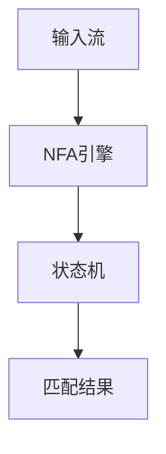
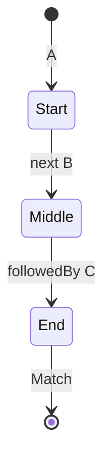

# Flink CEP 演进 特性跟踪

> 所属阶段: Flink/roadmap | 前置依赖: [CEP Library][^1] | 形式化等级: L4

## 1. 概念定义 (Definitions)

### Def-F-CEP-01: Complex Event Processing
复杂事件处理：
$$
\text{CEP} : \text{EventSequence} \times \text{Pattern} \to \text{ComplexEvent}
$$

### Def-F-CEP-02: Pattern Operator
模式操作符：
$$
\text{Op} \in \{\text{Next}, \text{FollowedBy}, \text{FollowedByAny}\}
$$

## 2. 属性推导 (Properties)

### Prop-F-CEP-01: Pattern Completeness
模式完整性：
$$
\text{Match} \Rightarrow \text{AllPatternConstraintsSatisfied}
$$

## 3. 关系建立 (Relations)

### CEP演进

| 版本 | 特性 |
|------|------|
| 1.x | 基础CEP |
| 2.0 | SQL MATCH_RECOGNIZE |
| 2.4 | 性能优化 |
| 3.0 | AI模式发现 |

## 4. 论证过程 (Argumentation)

### 4.1 CEP架构



## 5. 形式证明 / 工程论证

### 5.1 CEP模式定义

```java
Pattern<Event, ?> pattern = Pattern.<Event>begin("start")
    .where(evt -> evt.getType().equals("A"))
    .next("middle")
    .where(evt -> evt.getType().equals("B"))
    .followedBy("end")
    .where(evt -> evt.getType().equals("C"));
```

## 6. 实例验证 (Examples)

### 6.1 欺诈检测模式

```java
Pattern<Transaction, ?> fraudPattern = Pattern
    .<Transaction>begin("small")
    .where(t -> t.amount < 100)
    .next("large")
    .where(t -> t.amount > 10000)
    .within(Time.minutes(5));
```

## 7. 可视化 (Visualizations)



## 8. 引用参考 (References)

[^1]: Flink CEP Library

---

## 跟踪信息

| 属性 | 值 |
|------|-----|
| 涵盖版本 | 1.x-3.0 |
| 当前状态 | SQL集成 |
