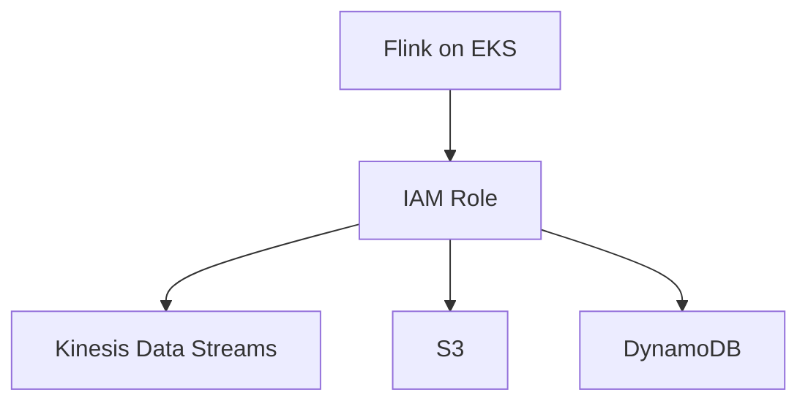
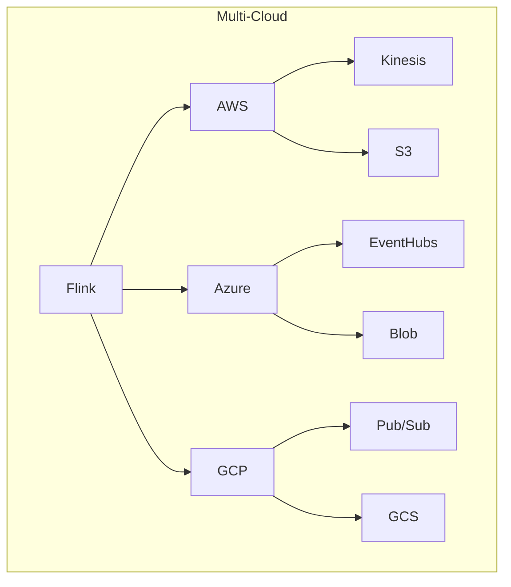

# Flink 云厂商 连接器 演进 特性跟踪

> 所属阶段: Flink/roadmap | 前置依赖: [Cloud Connectors][^1] | 形式化等级: L3

## 1. 概念定义 (Definitions)

### Def-F-CLOUD-01: Cloud-Native Service
云原生服务：
$$
\text{Service} : \text{Managed} \land \text{Scalable} \land \text{Serverless}
$$

### Def-F-CLOUD-02: Multi-Cloud Abstraction
多云抽象：
$$
\text{AbstractAPI} : \{AWS, Azure, GCP\} \to \text{UnifiedInterface}
$$

## 2. 属性推导 (Properties)

### Prop-F-CLOUD-01: Credential Management
凭证管理：
$$
\text{Credential} \in \{\text{IAMRole}, \text{ServicePrincipal}, \text{SAKey}\}
$$

## 3. 关系建立 (Relations)

### 云厂商连接器

| 云厂商 | 服务 | 状态 |
|--------|------|------|
| AWS | Kinesis, S3 | GA |
| Azure | EventHubs, Blob | GA |
| GCP | Pub/Sub, GCS | GA |
| 阿里云 | LogService, OSS | GA |

## 4. 论证过程 (Argumentation)

### 4.1 AWS集成



## 5. 形式证明 / 工程论证

### 5.1 Kinesis Source

```java
FlinkKinesisConsumer<String> consumer = new FlinkKinesisConsumer<>(
    "input-stream",
    new SimpleStringSchema(),
    config
);
```

## 6. 实例验证 (Examples)

### 6.1 Azure EventHubs

```java
EventHubSource<String> source = EventHubSource.<String>builder()
    .setConnectionString(connectionString)
    .setConsumerGroup("flink-group")
    .build();
```

## 7. 可视化 (Visualizations)



## 8. 引用参考 (References)

[^1]: Flink Cloud Connectors

---

## 跟踪信息

| 属性 | 值 |
|------|-----|
| 涵盖版本 | 1.x-3.0 |
| 当前状态 | GA |
