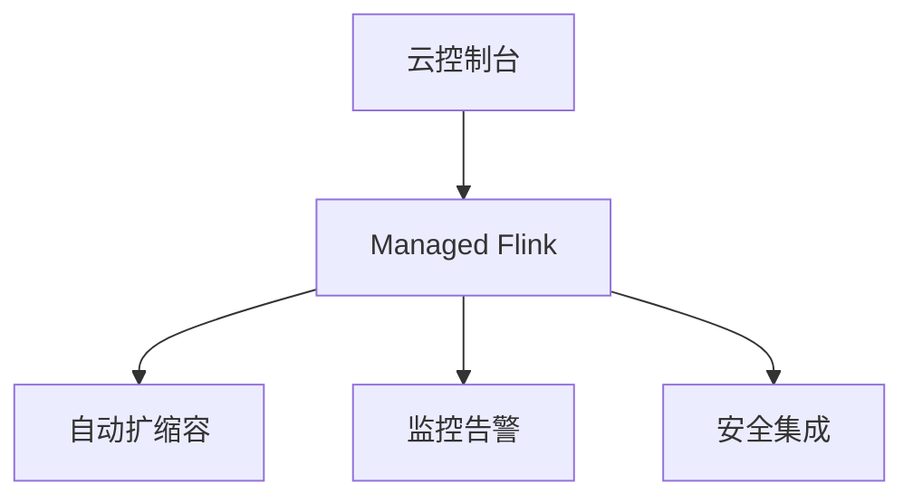
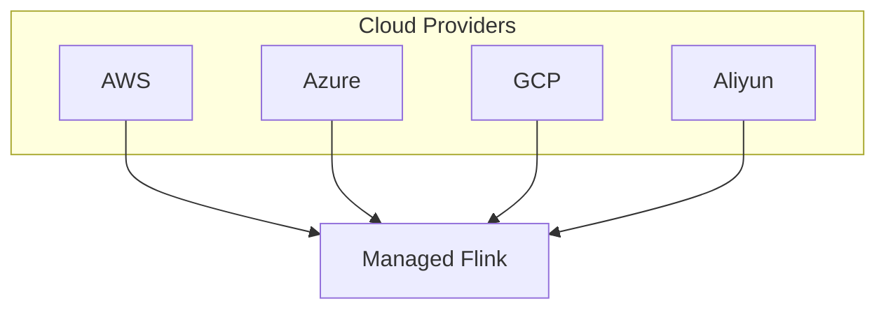

# Flink 云部署 演进 特性跟踪

> 所属阶段: Flink/roadmap | 前置依赖: [Cloud Providers][^1] | 形式化等级: L3

## 1. 概念定义 (Definitions)

### Def-F-CLOUD-01: Managed Service
托管服务：
$$
\text{ManagedFlink} = \text{Infrastructure} + \text{Maintenance} + \text{Support}
$$

### Def-F-CLOUD-02: Serverless Deployment
Serverless部署：
$$
\text{Serverless} : \text{Job} \to \text{AutoManagedResources}
$$

## 2. 属性推导 (Properties)

### Prop-F-CLOUD-01: Pay-Per-Use
按需付费：
$$
\text{Cost} \propto \text{ResourcesUsed} \times \text{Time}
$$

## 3. 关系建立 (Relations)

### 云厂商Flink服务

| 云厂商 | 服务 | 类型 |
|--------|------|------|
| AWS | Managed Flink | 托管 |
| Azure | HDInsight | 托管 |
| GCP | Dataproc | 托管 |
| 阿里云 | Ververica | 托管 |

## 4. 论证过程 (Argumentation)

### 4.1 云部署架构



## 5. 形式证明 / 工程论证

### 5.1 AWS Managed Flink

```bash
aws kinesisanalyticsv2 create-application \
    --application-name MyFlinkApp \
    --runtime-environment FLINK-2_4 \
    --service-execution-role arn:aws:iam::xxx:role/FlinkRole
```

## 6. 实例验证 (Examples)

### 6.1 阿里云Ververica

```yaml
apiVersion: vvp.ververica.com/v1
kind: Deployment
metadata:
  name: my-deployment
spec:
  template:
    spec:
      artifact:
        kind: JAR
        jarUri: https://example.com/job.jar
      parallelism: 4
```

## 7. 可视化 (Visualizations)



## 8. 引用参考 (References)

[^1]: AWS Managed Flink, Ververica Platform

---

## 跟踪信息

| 属性 | 值 |
|------|-----|
| 涵盖版本 | 1.x-3.0 |
| 当前状态 | 成熟 |
