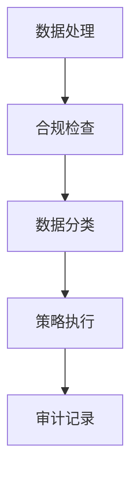
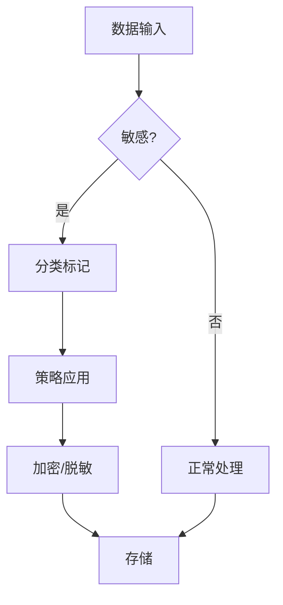

# Flink 合规性 演进 特性跟踪

> 所属阶段: Flink/roadmap | 前置依赖: [Compliance][^1] | 形式化等级: L3

## 1. 概念定义 (Definitions)

### Def-F-COMP-01: Compliance Standard
合规标准：
$$
\text{Standard} \in \{\text{GDPR}, \text{HIPAA}, \text{SOX}, \text{PCI-DSS}\}
$$

### Def-F-COMP-02: Data Residency
数据驻留：
$$
\text{Data} \in \text{GeographicBoundary}
$$

## 2. 属性推导 (Properties)

### Prop-F-COMP-01: Audit Trail
审计追踪：
$$
\forall \text{Access}, \exists \text{Log} : \text{Verifiable}
$$

## 3. 关系建立 (Relations)

### 合规演进

| 版本 | 支持 |
|------|------|
| 2.0 | 基础审计 |
| 2.4 | GDPR工具 |
| 3.0 | 自动合规 |

## 4. 论证过程 (Argumentation)

### 4.1 合规架构



## 5. 形式证明 / 工程论证

### 5.1 GDPR配置

```yaml
compliance:
  gdpr:
    enabled: true
    data-classification:
      - pii
      - sensitive
    retention:
      pii: 365d
      sensitive: 90d
    right-to-erasure: true
```

## 6. 实例验证 (Examples)

### 6.1 数据脱敏

```java
@Pseudonymize
public class UserData {
    @Sensitive
    private String ssn;
    
    @PII
    private String email;
}
```

## 7. 可视化 (Visualizations)



## 8. 引用参考 (References)

[^1]: GDPR, HIPAA Guidelines

---

## 跟踪信息

| 属性 | 值 |
|------|-----|
| 涵盖版本 | 2.0-3.0 |
| 当前状态 | GDPR支持 |
