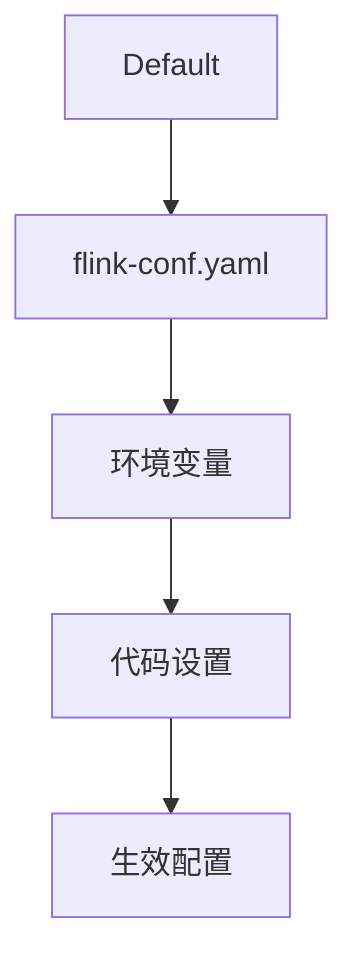
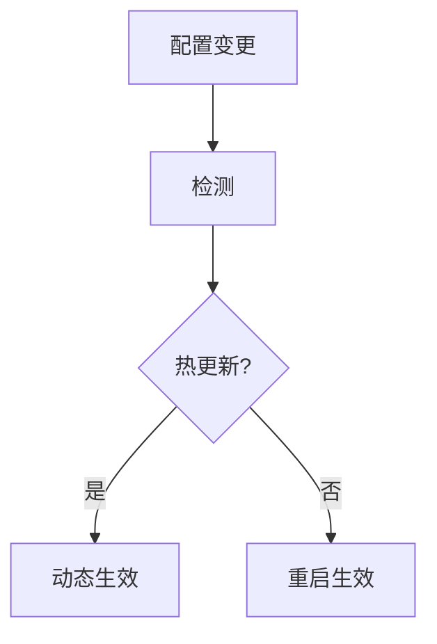

# Flink 配置管理 演进 特性跟踪

> 所属阶段: Flink/roadmap | 前置依赖: [Configuration][^1] | 形式化等级: L3

## 1. 概念定义 (Definitions)

### Def-F-CONFIG-01: Configuration Hierarchy
配置层级：
$$
\text{Config}_{\text{effective}} = f(\text{Default}, \text{File}, \text{Env}, \text{Code})
$$

### Def-F-CONFIG-02: Dynamic Config
动态配置：
$$
\text{Config}(t+1) \neq \text{Config}(t) \Rightarrow \text{NoRestart}
$$

## 2. 属性推导 (Properties)

### Prop-F-CONFIG-01: Override Order
覆盖优先级：
$$
\text{Code} \succ \text{Env} \succ \text{File} \succ \text{Default}
$$

## 3. 关系建立 (Relations)

### 配置管理演进

| 版本 | 特性 |
|------|------|
| 1.x | 静态配置 |
| 2.0 | 动态配置 |
| 2.4 | 热更新 |
| 3.0 | 声明式配置 |

## 4. 论证过程 (Argumentation)

### 4.1 配置架构



## 5. 形式证明 / 工程论证

### 5.1 动态配置

```java
// 运行时配置更新
Configuration config = new Configuration();
config.setString("parallelism.default", "10");
env.configure(config);
```

## 6. 实例验证 (Examples)

### 6.1 配置中心集成

```yaml
config:
  provider: consul
  consul:
    host: localhost:8500
    key: flink/config
  refresh-interval: 30s
```

## 7. 可视化 (Visualizations)



## 8. 引用参考 (References)

[^1]: Flink Configuration

---

## 跟踪信息

| 属性 | 值 |
|------|-----|
| 涵盖版本 | 1.x-3.0 |
| 当前状态 | 热更新支持 |
