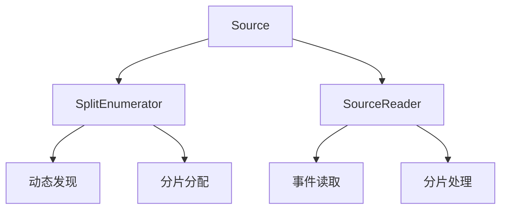
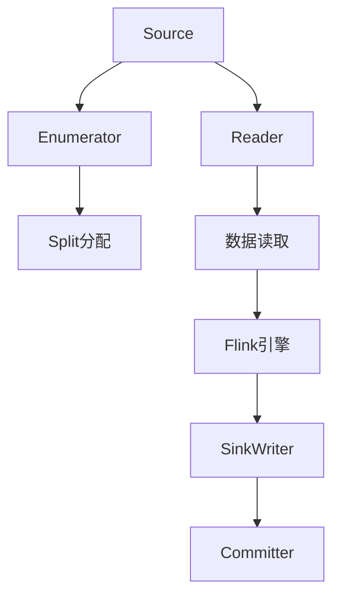

# Flink 连接器框架 演进 特性跟踪

> 所属阶段: Flink/roadmap | 前置依赖: [Connector API][^1] | 形式化等级: L4

## 1. 概念定义 (Definitions)

### Def-F-CF-01: Unified Connector API
统一连接器API：
```
Connector = Source + Sink + Lookup + Metadata
```

### Def-F-CF-02: Two-Phase Commit
两阶段提交：
$$
\text{2PC} = \text{Prepare} \circ \text{Commit} \circ \text{Abort}
$$

## 2. 属性推导 (Properties)

### Prop-F-CF-01: Exactly-Once Sink
精确一次Sink：
$$
\text{Prepare}(\text{State}) \land \text{Commit}(\text{State}) \Rightarrow \text{ExactlyOnce}
$$

## 3. 关系建立 (Relations)

### 连接器框架演进

| 版本 | API |
|------|-----|
| 1.x | 旧SourceFunction |
| 2.0 | 新Source/Sink API |
| 2.4 | Lookup + Metadata |
| 3.0 | Unified API |

## 4. 论证过程 (Argumentation)

### 4.1 Source V2架构



## 5. 形式证明 / 工程论证

### 5.1 自定义连接器

```java
public class MySource implements Source<Event, MySplit, MyCheckpoint> {
    @Override
    public SplitEnumerator<MySplit, MyCheckpoint> 
           createEnumerator(SplitEnumeratorContext<MySplit> context) {
        return new MySplitEnumerator(context);
    }
    
    @Override
    public SourceReader<Event, MySplit> 
           createReader(SourceReaderContext readerContext) {
        return new MySourceReader(readerContext);
    }
}
```

## 6. 实例验证 (Examples)

### 6.1 Sink V2实现

```java
public class MySink implements TwoPhaseCommittingSink<Event, MyCommittable> {
    @Override
    public PrecommittingSinkWriter<Event, MyCommittable> createWriter(InitContext ctx) {
        return new MySinkWriter();
    }
    
    @Override
    public Committer<MyCommittable> createCommitter() {
        return new MyCommitter();
    }
}
```

## 7. 可视化 (Visualizations)



## 8. 引用参考 (References)

[^1]: Flink Connector Development Guide

---

## 跟踪信息

| 属性 | 值 |
|------|-----|
| 涵盖版本 | 1.x-3.0 |
| 当前状态 | V2 GA |
