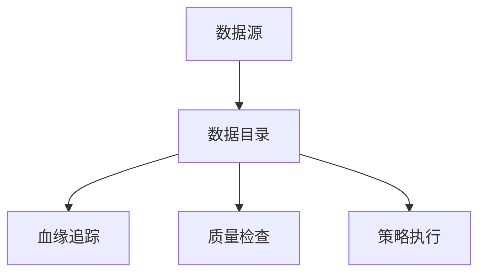
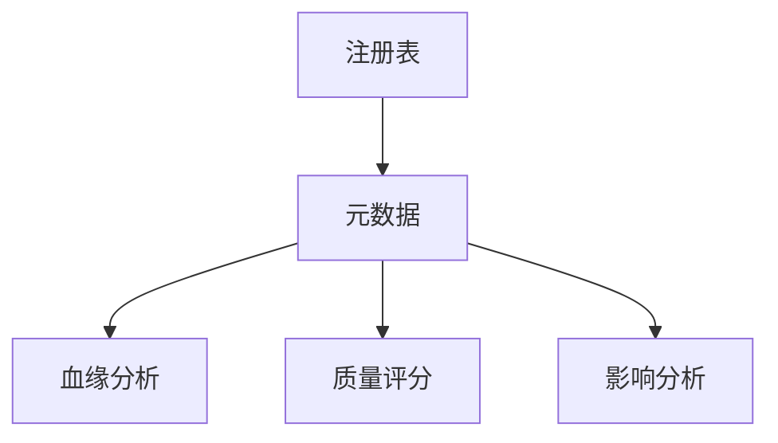

# Flink 数据治理 演进 特性跟踪

> 所属阶段: Flink/roadmap | 前置依赖: [Data Governance][^1] | 形式化等级: L3

## 1. 概念定义 (Definitions)

### Def-F-GOV-01: Data Catalog
数据目录：
$$
\text{Catalog} = \{\text{Table}_i, \text{Metadata}_i\}_{i=1}^n
$$

### Def-F-GOV-02: Data Quality
数据质量：
$$
\text{Quality} = \frac{|\text{ValidData}|}{|\text{TotalData}|}
$$

## 2. 属性推导 (Properties)

### Prop-F-GOV-01: Lineage Completeness
血缘完整性：
$$
\text{Lineage} : \text{Source} \to \text{Transformations} \to \text{Sink}
$$

## 3. 关系建立 (Relations)

### 数据治理演进

| 版本 | 特性 |
|------|------|
| 2.0 | Hive Catalog |
| 2.4 | 统一Catalog |
| 3.0 | 智能治理 |

## 4. 论证过程 (Argumentation)

### 4.1 治理架构



## 5. 形式证明 / 工程论证

### 5.1 Unity Catalog集成

```sql
CREATE CATALOG unity_catalog WITH (
    'type' = 'unity',
    'token' = '${UNITY_TOKEN}',
    'workspace' = 'https://dbc-xxx.cloud.databricks.com'
);
```

## 6. 实例验证 (Examples)

### 6.1 数据质量检查

```yaml
data.quality:
  rules:
    - column: user_id
      type: not_null
    - column: amount
      type: range
      min: 0
      max: 1000000
    - column: email
      type: pattern
      regex: '^[\w.-]+@[\w.-]+$'
```

## 7. 可视化 (Visualizations)



## 8. 引用参考 (References)

[^1]: Apache Atlas, DataHub

---

## 跟踪信息

| 属性 | 值 |
|------|-----|
| 涵盖版本 | 2.0-3.0 |
| 当前状态 | 统一Catalog |
