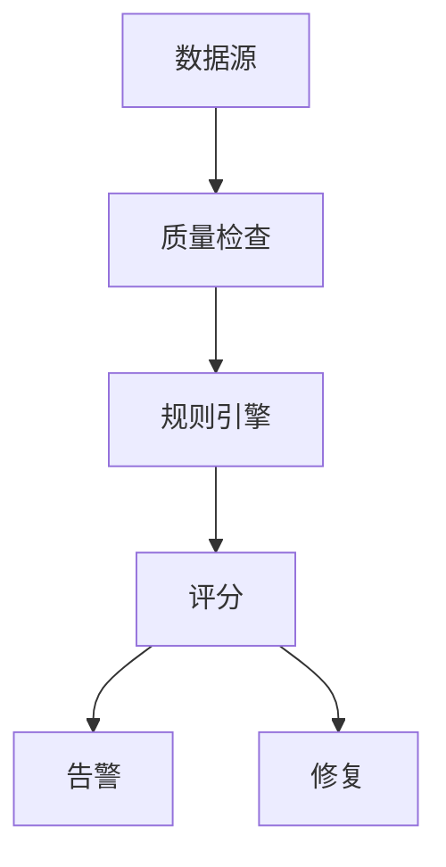
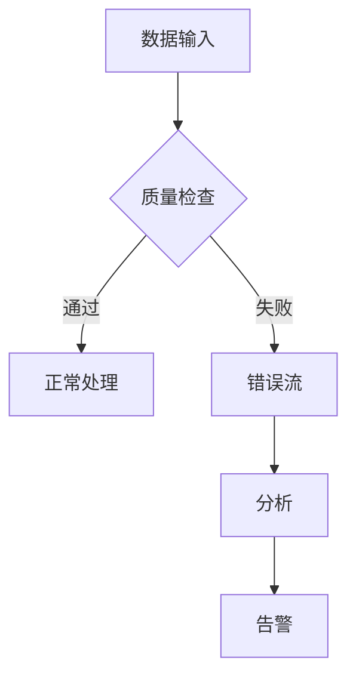

# Flink 数据质量 演进 特性跟踪

> 所属阶段: Flink/roadmap | 前置依赖: [Data Quality][^1] | 形式化等级: L3

## 1. 概念定义 (Definitions)

### Def-F-DQ-01: Data Quality Dimension
数据质量维度：
$$
\text{Dimension} \in \{\text{Completeness}, \text{Accuracy}, \text{Consistency}, \text{Timeliness}\}
$$

### Def-F-DQ-02: Quality Score
质量评分：
$$
\text{Score} = \sum_{i} w_i \cdot \text{Metric}_i, \sum w_i = 1
$$

## 2. 属性推导 (Properties)

### Prop-F-DQ-01: Rule Validation
规则验证：
$$
\text{Valid}(d) \iff \forall r \in \text{Rules} : r(d) = \text{true}
$$

## 3. 关系建立 (Relations)

### 数据质量演进

| 版本 | 特性 |
|------|------|
| 2.0 | 基础检查 |
| 2.4 | SQL约束 |
| 3.0 | ML质量监控 |

## 4. 论证过程 (Argumentation)

### 4.1 质量架构



## 5. 形式证明 / 工程论证

### 5.1 质量约束

```sql
CREATE TABLE events (
    user_id STRING NOT NULL,
    amount DECIMAL(10,2) CHECK (amount >= 0),
    email STRING CHECK (email REGEXP '^[\w.-]+@[\w.-]+$'),
    WATERMARK FOR event_time AS event_time - INTERVAL '5' SECOND
) WITH (
    'quality.check.enabled' = 'true',
    'quality.score.metric' = 'flink_data_quality'
);
```

## 6. 实例验证 (Examples)

### 6.1 质量监控

```java
public class QualityMonitor extends ProcessFunction<Row, Row> {
    private transient Meter invalidRecords;
    
    @Override
    public void open(Configuration parameters) {
        invalidRecords = getRuntimeContext()
            .getMetricGroup()
            .meter("invalidRecords", new DropwizardMeterWrapper(new Meter()));
    }
    
    @Override
    public void processElement(Row row, Context ctx, Collector<Row> out) {
        if (!validator.isValid(row)) {
            invalidRecords.markEvent();
            return;
        }
        out.collect(row);
    }
}
```

## 7. 可视化 (Visualizations)



## 8. 引用参考 (References)

[^1]: Deequ, Great Expectations

---

## 跟踪信息

| 属性 | 值 |
|------|-----|
| 涵盖版本 | 2.0-3.0 |
| 当前状态 | SQL约束 |
