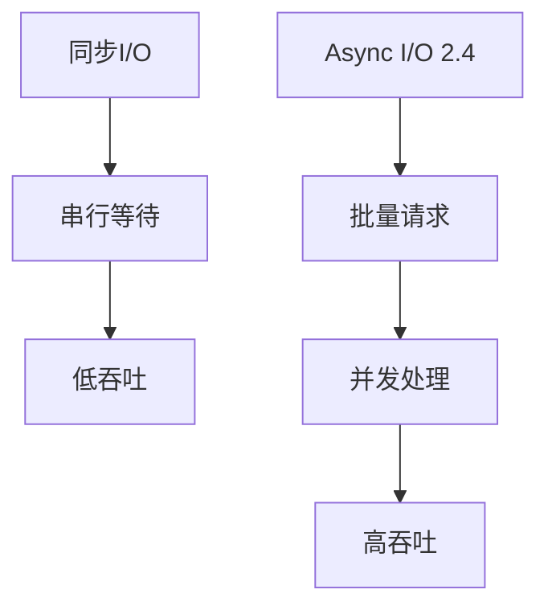
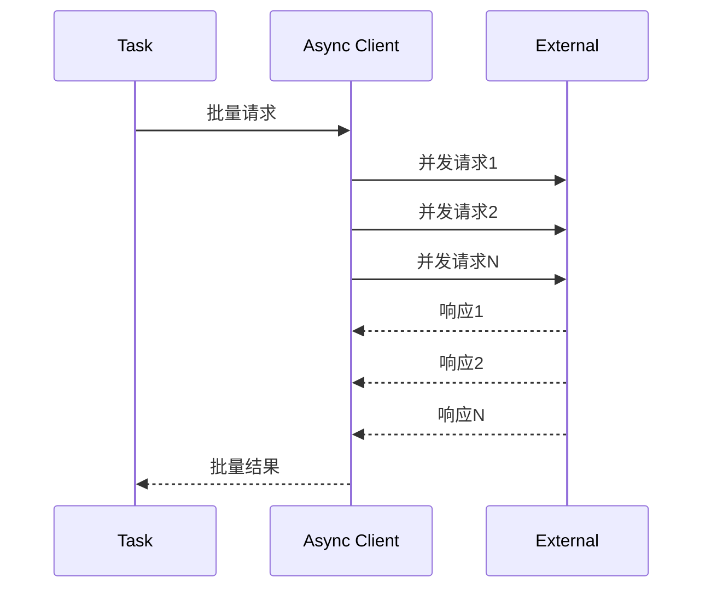

# Flink DataStream API 2.4 演进 特性跟踪

> 所属阶段: Flink/roadmap | 前置依赖: [DataStream API][^1] | 形式化等级: L3

## 1. 概念定义 (Definitions)

### Def-F-DS24-01: Record-Oriented Processing

面向记录处理：
$$
\text{Process} : \text{Record} \to \text{Record}'
$$

### Def-F-DS24-02: Async I/O Pattern

异步I/O模式：
$$
\text{AsyncOp} : \text{Input} \xrightarrow{\text{async}} \text{Future}<\text{Output}>
$$

## 2. 属性推导 (Properties)

### Prop-F-DS24-01: Async Ordering

异步结果排序保证：
$$
\text{OutputOrder} \in \{\text{ORDERED}, \text{UNORDERED}\}
$$

## 3. 关系建立 (Relations)

### 2.4 API改进

| 特性 | 描述 | 状态 |
|------|------|------|
| Async I/O增强 | 批量请求 | GA |
| State TTL策略 | 清理策略 | GA |
| ProcessFunction | 计时器优化 | GA |
| Side Output | 多输出流 | GA |

## 4. 论证过程 (Argumentation)

### 4.1 Async I/O演进



## 5. 形式证明 / 工程论证

### 5.1 Async批量优化

```java
// 2.4批量Async I/O
AsyncDataStream.unorderedWait(
    stream,
    new AsyncFunction<String, String>() {
        @Override
        public void asyncInvoke(String input, ResultFuture<String> resultFuture) {
            // 批量请求API
            batchClient.asyncRequest(List.of(input), resultFuture);
        }
    },
    1000, TimeUnit.MILLISECONDS
).setCapacity(100);  // 批量大小
```

## 6. 实例验证 (Examples)

### 6.1 State TTL配置

```java
StateTtlConfig ttlConfig = StateTtlConfig
    .newBuilder(Time.hours(24))
    .setUpdateType(StateTtlConfig.UpdateType.OnCreateAndWrite)
    .setStateVisibility(StateTtlConfig.StateVisibility.ReturnExpiredIfNotCleanedUp)
    .cleanupFullSnapshot()
    .build();
```

## 7. 可视化 (Visualizations)



## 8. 引用参考 (References)

[^1]: Flink DataStream API Guide

---

## 跟踪信息

| 属性 | 值 |
|------|-----|
| 目标版本 | Flink 2.4 |
| 当前状态 | 开发中 |
