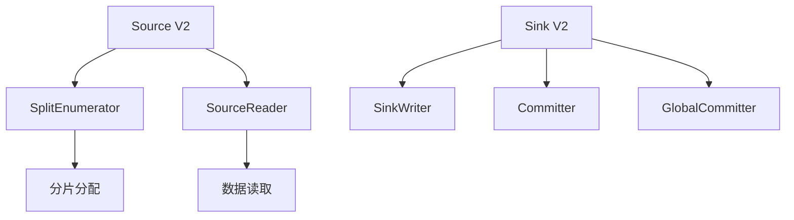
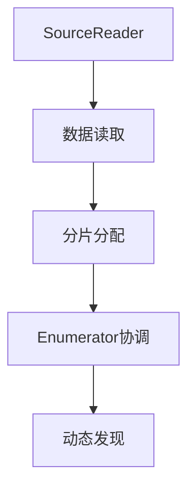

# Flink DataStream API 2.5 演进 特性跟踪

> 所属阶段: Flink/roadmap | 前置依赖: [2.4 DataStream][^1] | 形式化等级: L3

## 1. 概念定义 (Definitions)

### Def-F-DS25-01: Unified Source Interface

统一Source接口：

```
Source = SplitEnumerator + SourceReader + Split
```

### Def-F-DS25-02: Sink V2 API

Sink V2 API：

```
Sink = SinkWriter + Committer + GlobalCommitter
```

## 2. 属性推导 (Properties)

### Prop-F-DS25-01: Exactly-Once Guarantee

Sink V2精确一次保证：
$$
\text{Commit} \circ \text{Prepare} \Rightarrow \text{Exactly-Once}
$$

## 3. 关系建立 (Relations)

### 2.5 API改进

| 特性 | 描述 | 状态 |
|------|------|------|
| Source V2 | 统一Source | GA |
| Sink V2 | 两阶段提交 | GA |
| Watermark生成 | 标准化 | GA |
| 检查点监听器 | 生命周期 | Beta |

## 4. 论证过程 (Argumentation)

### 4.1 Source/Sink V2架构



## 5. 形式证明 / 工程论证

### 5.1 自定义Source

```java
public class MySource implements Source<Event, MySplit, MyCheckpoint> {
    @Override
    public SplitEnumerator<MySplit, MyCheckpoint> createEnumerator() {
        return new MySplitEnumerator();
    }

    @Override
    public SourceReader<Event, MySplit> createReader(SourceReaderContext ctx) {
        return new MySourceReader(ctx);
    }
}
```

## 6. 实例验证 (Examples)

### 6.1 Sink V2实现

```java
public class MySink implements TwoPhaseCommittingSink<Event, MyCommittable> {
    @Override
    public PrecommittingSinkWriter<Event, MyCommittable> createWriter(InitContext ctx) {
        return new MySinkWriter();
    }

    @Override
    public Committer<MyCommittable> createCommitter() {
        return new MyCommitter();
    }
}
```

## 7. 可视化 (Visualizations)



## 8. 引用参考 (References)

[^1]: Flink 2.4 DataStream

---

## 跟踪信息

| 属性 | 值 |
|------|-----|
| 目标版本 | Flink 2.5 |
| 当前状态 | GA |
