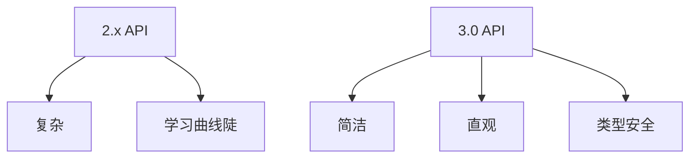

# Flink DataStream API 3.0 演进 特性跟踪

> 所属阶段: Flink/roadmap | 前置依赖: [2.5 DataStream][^1] | 形式化等级: L4

## 1. 概念定义 (Definitions)

### Def-F-DS30-01: Unified Data API

统一数据API：
$$
\text{DataAPI} : \text{Batch} \cup \text{Streaming} \to \text{Result}
$$

### Def-F-DS30-02: Declarative Transformation

声明式转换：
$$
\text{Transform} = \text{What}, \text{ not } \text{How}
$$

## 2. 属性推导 (Properties)

### Prop-F-DS30-01: Mode Transparency

模式透明性：
$$
\text{SameAPI}(\text{Batch}) \equiv \text{SameAPI}(\text{Streaming})
$$

## 3. 关系建立 (Relations)

### 3.0 API变革

| 特性 | 描述 | 状态 |
|------|------|------|
| 统一API | 流批一体 | 设计 |
| 类型安全 | 编译时检查 | 规划 |
| 声明式 | SQL集成 | 设计 |
| 响应式 | Reactive Streams | 规划 |

## 4. 论证过程 (Argumentation)

### 4.1 3.0 API愿景



## 5. 形式证明 / 工程论证

### 5.1 3.0 API设计

```java
// 3.0愿景API
FlinkJob job = FlinkJob.builder()
    .source("kafka", cfg -> cfg.topic("events"))
    .transform(ctx -> ctx
        .filter(e -> e.getValue() > 100)
        .keyBy(Event::getUserId)
        .window(TumblingWindows.of(Duration.ofMinutes(5)))
        .aggregate(Count::new)
    )
    .sink("iceberg", cfg -> cfg.table("results"));
```

## 6. 实例验证 (Examples)

### 6.1 响应式API

```java
// Reactive Streams支持
ReactiveFlink.source(kafkaSource)
    .transform(flow -> flow
        .map(this::enrich)
        .filter(this::isValid)
    )
    .subscribe(sink::write);
```

## 7. 可视化 (Visualizations)


## 8. 引用参考 (References)

[^1]: Flink 2.5 DataStream

---

## 跟踪信息

| 属性 | 值 |
|------|-----|
| 目标版本 | Flink 3.0 |
| 当前状态 | 愿景阶段 |
